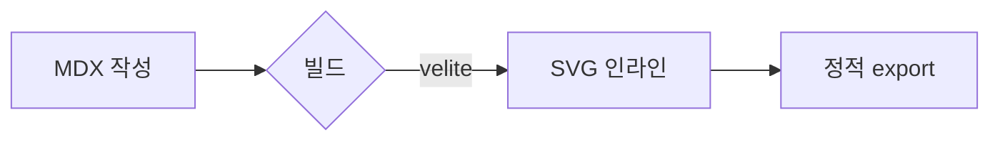
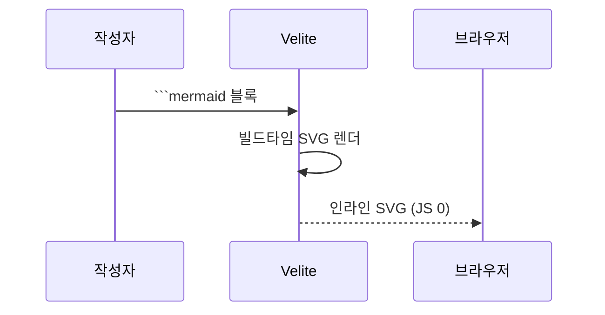

이 글은 **렌더링 검증용 데모**입니다. 블로그의 MDX 파이프라인(`remark-gfm` + `rehype-mermaid` + `rehype-pretty-code` + `shiki`)이 어떤 문법을 어떻게 보여주는지 한눈에 확인할 수 있습니다.

## 텍스트 스타일

본문에서는 **굵게**, _기울임_, **_굵은 기울임_**, ~~취소선~~, 그리고 `인라인 코드`를 섞어 쓸 수 있습니다. 링크는 [내부 문서](/docs)나 [외부 사이트](https://nextjs.org)처럼 답니다.

각주도 지원합니다. 정적 사이트 생성은 빌드 시점에 HTML을 만들어 둡니다.[^ssg] 그래서 첫 응답이 빠릅니다.[^speed]

## 인용구

> 좋은 글쓰기는 좋은 생각하기에서 나온다.
>
> 인용구 안에서도 **강조**와 `코드`를 쓸 수 있고, 여러 문단으로 이어질 수 있습니다.

## 목록

### 순서 없는 목록 (중첩)

- 읽기 경험을 먼저 설계한다
  - 타이포그래피와 간격
  - 코드 가독성
- 인터랙션은 최소화한다
- 콘텐츠는 MDX로 관리한다

### 순서 있는 목록

1. 콘텐츠를 작성한다
2. Velite가 빌드한다
3. 정적 페이지로 익스포트한다

### 체크박스 (GFM)

- [x] MDX 파이프라인 구성
- [x] 코드 하이라이팅 CSS
- [ ] 댓글 기능
- [ ] 검색 기능

## 표 (GFM)

| 문법 | 플러그인 | 지원 여부 |
| ---- | -------- | :------: |
| 표 | remark-gfm | ✅ |
| 각주 | remark-gfm | ✅ |
| 코드 하이라이팅 | rehype-pretty-code | ✅ |
| 헤딩 앵커 | rehype-slug | ✅ |

## 코드 블록

### 기본 + 파일명 타이틀

```ts filename="velite.config.ts"
import { defineConfig, s } from "velite";

export const posts = {
  name: "Post",
  pattern: "posts/**/*.mdx",
};
```

### 라인 하이라이트 + 줄 번호 + 캡션

```tsx {3-4} showLineNumbers caption="강조된 줄에 주목하세요"
export function PostContent({ code }: { code: string }) {
  const Component = useMDXComponent(code);
  // 이 두 줄이 핵심입니다
  return <Component />;
}
```

### 단어 하이라이트

```ts /useMemo/
const value = useMemo(() => compute(input), [input]);
const other = useMemo(() => derive(value), [value]);
```

### 다른 언어들

```bash
bun run dev
bun run build
```

```json
{
  "output": "export",
  "trailingSlash": true
}
```

## 다이어그램 (Mermaid)

` ```mermaid ` 코드블록은 빌드 시점에 SVG로 렌더되어 정적 HTML에 인라인됩니다(클라이언트 JS 0).

### Flowchart



### Sequence



## 구분선

---

## 이미지


## 마치며

이 정도면 일상적인 글쓰기에서 필요한 문법은 거의 다 다룹니다. 문법이 깨져 보인다면 `src/app/globals.css`의 `.prose` 규칙을 먼저 확인하세요.

[^ssg]: Static Site Generation. 빌드 시점에 페이지를 미리 렌더링합니다.
[^speed]: 미리 만들어 둔 HTML을 그대로 내려주기 때문입니다.
