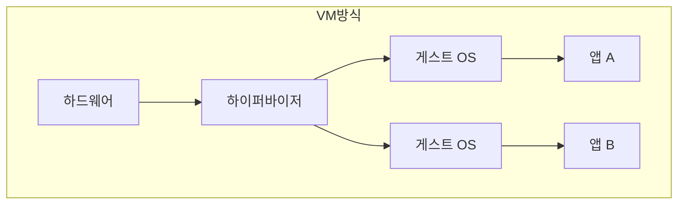
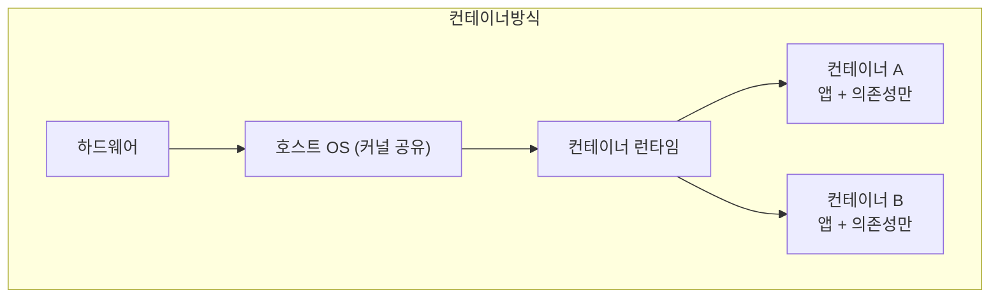

이 시리즈의 첫 챕터입니다. Kubernetes의 명령어를 외우기 전에, **왜 이런 도구가 세상에 필요했는지**부터 짚습니다.
도구는 항상 어떤 고통을 없애기 위해 태어납니다. 그 고통을 모르면 도구의 설계가 통째로 암기 대상이 되지만,
고통을 이해하면 대부분의 설계가 "그래서 이렇게 됐구나"로 자연스럽게 읽힙니다.

## 왜 필요한가 (Why)

### 배포의 진화: 한 줄로 보면

애플리케이션을 "어디서 어떻게 실행할 것인가"는 지난 20년간 세 번 크게 바뀌었습니다.

각 단계는 앞 단계의 **고통**을 없애려고 등장했습니다. 하나씩 봅니다.

### 1단계 — 베어메탈: 서버 한 대에 앱 한 덩어리

초기에는 물리 서버에 OS를 깔고 그 위에 애플리케이션을 직접 올렸습니다. 문제는 명확했습니다.

- **자원 낭비**: 서버 한 대를 앱 하나가 독차지. 평소 CPU 5%만 쓰는 앱이 서버 전체를 점유합니다.
- **느린 증설**: 트래픽이 늘면 서버를 새로 사서 랙에 꽂고 세팅해야 합니다. 며칠~몇 주가 걸립니다.
- **"내 서버에선 됐는데"**: 서버마다 OS 버전, 라이브러리, 환경변수가 미묘하게 달라 배포할 때마다 사고가 납니다.

### 2단계 — 가상화(VM): 서버 한 대를 여러 대처럼

하이퍼바이저(VMware, KVM 등)가 물리 서버 한 대를 여러 개의 **가상 머신**으로 쪼갰습니다.
자원을 나눠 쓰니 활용률이 올라가고, 이미지를 복제해 증설 속도도 빨라졌습니다.

하지만 VM에는 본질적 비용이 있습니다. **VM마다 게스트 OS 전체가 들어간다**는 점입니다.

게스트 OS 하나가 수 GB의 디스크와 수백 MB의 메모리를 먹고, 부팅에 수십 초가 걸립니다.
앱 하나 띄우자고 운영체제 한 벌을 통째로 짊어지는 셈입니다.

### 3단계 — 컨테이너: OS는 공유하고 앱만 격리

컨테이너는 발상을 바꿉니다. **OS 커널은 호스트와 공유하고, 그 위에서 프로세스만 격리**합니다.
리눅스의 namespace(격리)와 cgroup(자원 제한)이라는 커널 기능을 이용합니다.

결과적으로 컨테이너는 VM 대비:

- **가볍다**: 게스트 OS가 없으니 수십 MB 수준. 부팅이 아니라 프로세스 시작이라 **수백 ms 만에 뜬다**.
- **이식성**: 앱과 그 의존성을 이미지 하나로 묶어 굽는다. 어디서 실행하든 똑같이 동작 → "내 서버에선 됐는데" 문제가 사라진다.
- **밀도**: 서버 한 대에 컨테이너 수십~수백 개를 올릴 수 있다.

### 그런데, 컨테이너가 많아지자 새로운 고통이 생겼다

컨테이너 하나를 다루는 건 쉽습니다. `docker run` 한 줄이면 됩니다.
문제는 **수백 개의 컨테이너를 여러 대의 서버에 걸쳐 운영**할 때 시작됩니다.

- 컨테이너가 죽으면 누가 다시 살리나? (자가 치유)
- 트래픽이 늘면 컨테이너를 몇 개로 늘리고, 줄면 어떻게 줄이나? (스케일링)
- 새 컨테이너는 **어느 서버**에 올려야 자원이 효율적인가? (스케줄링)
- 컨테이너 IP는 계속 바뀌는데, 서로 어떻게 찾아 통신하나? (서비스 디스커버리)
- 무중단으로 새 버전을 어떻게 교체하나? (롤링 업데이트)
- 서버 한 대가 통째로 죽으면 그 위 컨테이너들은? (장애 복구)

이 질문들에 **사람이 손으로** 답하면, 컨테이너 수가 늘수록 운영 부담이 기하급수로 커집니다.
바로 이 지점에서 **오케스트레이션(orchestration)** 이 등장합니다.

## 핵심 개념 (What)

### 오케스트레이션이란

오케스트레이션은 **여러 서버(노드)에 걸친 다수의 컨테이너를, 사람이 일일이 손대지 않고
자동으로 배치·연결·치유·확장하는 일**을 뜻합니다. 오케스트라의 지휘자가 수십 명의 연주자를
조율하듯, 오케스트레이터가 수많은 컨테이너를 조율합니다.

### Kubernetes란

**Kubernetes(쿠버네티스, 줄여서 K8s)** 는 구글이 내부에서 쓰던 Borg의 경험을 바탕으로 만들어
2014년 오픈소스로 공개한, 사실상 표준이 된 컨테이너 오케스트레이터입니다.
(`K8s`는 K와 s 사이에 글자가 8개라서 붙은 약칭입니다.)

Kubernetes를 한 문장으로 정의하면 이렇습니다.

> **"원하는 상태(desired state)를 선언하면, 실제 상태가 그것과 같아지도록 끊임없이 맞춰주는 시스템."**

이 한 문장이 Kubernetes 전체를 관통하는 핵심 사상입니다. 다음 절에서 이게 실제로 어떻게 도는지 봅니다.

## 어떻게 동작하는가 (How)

### 선언적 모델과 조정 루프(reconciliation loop)

전통적인 운영은 **명령형(imperative)** 입니다. "컨테이너를 켜라", "하나 더 켜라", "이걸 꺼라"처럼
**행동을 하나씩 지시**합니다. 사람이 현재 상태를 파악하고 다음 행동을 계속 정해줘야 합니다.

Kubernetes는 **선언형(declarative)** 입니다. 행동이 아니라 **결과(원하는 상태)** 를 선언합니다.
예: "이 앱의 복제본을 항상 3개 유지하라."

그러면 Kubernetes는 **조정 루프**를 돌립니다. 현재 상태를 관찰하고, 원하는 상태와 비교하고,
차이가 있으면 메우는 행동을 스스로 취하는 일을 **무한히 반복**합니다.

예를 들어 복제본 3개를 원했는데 컨테이너 하나가 죽어 2개가 되면, 루프가 그 차이를 발견하고
새 컨테이너를 1개 띄워 다시 3개로 맞춥니다. **자가 치유(self-healing)** 가 별도 기능이 아니라
이 루프의 자연스러운 결과라는 점이 중요합니다.

### 명령형 vs 선언형 비유

엘리베이터로 비유하면:

- **명령형**: "위로 한 층, 또 한 층, 멈춰…" 를 계속 지시 → 중간에 끊기면 어디서 멈출지 모름.
- **선언형**: "3층으로 가" 만 누름 → 어디서 출발하든, 도중에 멈췄다 재개해도 결국 3층에 도달.

선언형은 **목표 상태를 기억**하므로, 장애가 나도 시스템이 알아서 원하는 상태로 수렴합니다.
Kubernetes가 견고한 이유의 핵심입니다.

## 트레이드오프

Kubernetes는 만능이 아닙니다. 강력함의 대가가 있습니다.

| 측면 | 얻는 것 | 치르는 비용 |
| ---- | ------- | ----------- |
| 운영 자동화 | 자가 치유, 자동 스케일링, 무중단 배포 | 시스템 자체의 **높은 학습 곡선**과 운영 복잡도 |
| 이식성 | 클라우드/온프레미스 어디서든 동일 | 추상화 계층이 두꺼워 **디버깅 난이도 상승** |
| 선언적 모델 | 재현성, 버전 관리(GitOps) | 단순 작업도 YAML 작성이 필요해 **초기 진입 비용** |
| 자원 효율 | 높은 컨테이너 밀도, 빈 자원 활용 | Control Plane 등 **클러스터 운영 오버헤드** |

핵심 판단 기준은 **규모와 변화 빈도**입니다.

- 서비스가 1~2개이고 트래픽이 일정하다면, Kubernetes는 **과한 선택**일 수 있습니다.
  (단일 VM, 매니지드 PaaS, `docker compose` 정도가 더 합리적)
- 서비스가 많고, 자주 배포하고, 트래픽이 출렁이고, 무중단·자가 치유가 중요하다면
  그 복잡도를 감수할 값어치가 생깁니다.

> 한 줄 요약: **Kubernetes는 복잡도를 "없애는" 게 아니라, 흩어진 운영 복잡도를 한곳으로 "모아 표준화"한다.**

## 사이드 이펙트와 주의점

도입하면 따라오는 부작용들입니다. 미리 알면 함정을 피할 수 있습니다.

- **추상화의 그늘**: 문제가 났을 때 원인이 앱인지, 네트워크인지, 스케줄러인지, 노드인지 층이 많아
  추적이 어렵습니다. 옵저버빌리티(로그·메트릭·트레이스, Ch14)가 **선택이 아니라 필수**가 됩니다.
- **운영 인력/지식 요구**: 클러스터 자체가 운영 대상입니다. 업그레이드, 인증서, 백업(etcd) 등
  "앱이 아닌 플랫폼"을 돌보는 일이 새로 생깁니다. (그래서 매니지드 K8s — EKS/GKE/AKS — 를 많이 씁니다.)
- **YAML 폭증**: 매니페스트가 빠르게 늘어 관리가 어려워집니다. 템플릿화(Helm/Kustomize, Ch11)가 곧 필요해집니다.
- **컨테이너는 VM만큼 강한 격리가 아니다**: 커널을 공유하므로 보안 격리 강도는 VM보다 약합니다.
  멀티테넌시·보안 경계(Ch10)를 별도로 설계해야 합니다.
- **"상태 없는 앱" 가정에 가깝다**: Kubernetes는 stateless 워크로드에서 가장 빛납니다.
  DB 같은 상태 저장 워크로드는 추가 설계(PV/PVC, StatefulSet, Ch7)가 필요합니다.

## 용어 정리

| 용어 | 설명 |
| ---- | ---- |
| 베어메탈(Bare metal) | 가상화 없이 물리 서버에 OS와 앱을 직접 올린 환경 |
| VM(가상 머신) | 하이퍼바이저가 만든 가상 컴퓨터. 게스트 OS 전체를 포함해 무겁다 |
| 하이퍼바이저(Hypervisor) | 물리 자원을 쪼개 여러 VM을 만들고 관리하는 가상화 계층 |
| 컨테이너(Container) | 호스트 커널을 공유한 채 프로세스만 격리해 실행하는 경량 실행 단위 |
| namespace / cgroup | 컨테이너 격리(namespace)와 자원 제한(cgroup)을 제공하는 리눅스 커널 기능 |
| 컨테이너 이미지(Image) | 앱과 의존성을 묶어 구운 불변 패키지. 컨테이너의 실행 원본 |
| 컨테이너 런타임(Runtime) | 이미지를 받아 실제 컨테이너로 실행하는 엔진(containerd 등) |
| 오케스트레이션(Orchestration) | 다수 노드의 다수 컨테이너를 자동으로 배치·연결·치유·확장하는 일 |
| Kubernetes(K8s) | 사실상 표준인 오픈소스 컨테이너 오케스트레이터 |
| 노드(Node) | 컨테이너가 실제로 실행되는 서버(물리/가상) 한 대 |
| 원하는 상태(Desired state) | 사용자가 선언한 목표 상태. 예: "복제본 3개" |
| 조정 루프(Reconciliation loop) | 현재 상태를 원하는 상태와 비교해 계속 맞추는 무한 반복 과정 |
| 선언형 / 명령형 | 결과를 선언(선언형) vs 행동을 하나씩 지시(명령형)하는 운영 방식 |
| 자가 치유(Self-healing) | 죽은 컨테이너를 자동 복구하는 능력. 조정 루프의 산물 |

---

다음 챕터(Ch 2)에서는 이 "조정 루프"가 실제로 어떤 부품들로 돌아가는지 —
**Control Plane과 Worker Node의 아키텍처** — 를 분해해 봅니다.
