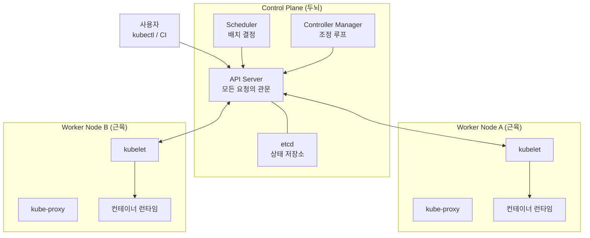
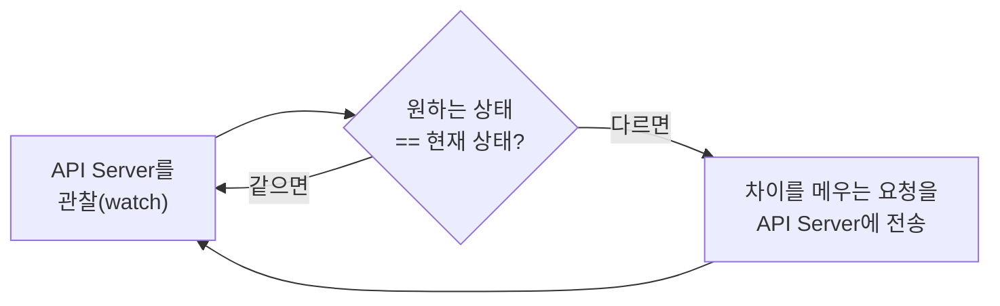
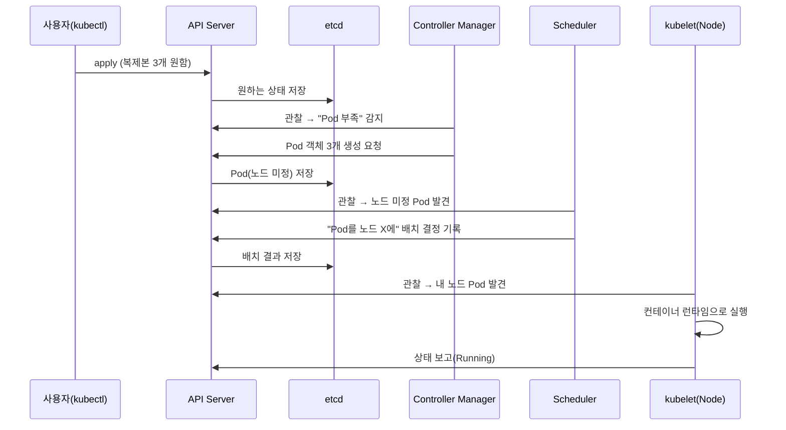

Ch1에서 Kubernetes를 "원하는 상태를 선언하면 실제 상태를 맞춰주는 시스템"이라고 정의했습니다.
그리고 그 핵심이 **조정 루프**라고 했습니다. 이번 챕터의 목표는 단 하나입니다.

> **"그 조정 루프는 도대체 어떤 부품들이 모여서 돌리는가?"**

부품의 이름을 외우는 게 목적이 아닙니다. 각 부품이 **왜 따로 존재하는지**, 그리고 부품들이
**어떻게 협력해서** `kubectl apply` 한 줄을 실제 실행으로 바꾸는지를 이해하는 게 목적입니다.

## 왜 필요한가 (Why)

### "큰 두뇌 하나"가 아니라 "작은 부품들의 협업"인 이유

조정 루프를 가장 단순하게 만들면, 모든 걸 다 하는 거대한 프로그램 하나로 짤 수도 있습니다.
하지만 Kubernetes는 일부러 그렇게 하지 않았습니다. 이유는 분산 시스템의 두 가지 현실 때문입니다.

- **장애는 일상이다**: 서버는 죽고, 네트워크는 끊깁니다. 하나의 거대 프로세스가 죽으면 클러스터
  전체가 멈춥니다. 역할을 작은 컴포넌트로 쪼개면, 일부가 죽어도 나머지가 버티고 복구할 수 있습니다.
- **관심사를 분리해야 확장된다**: "무엇을 원하는가(상태 저장)", "어디에 둘까(스케줄링)",
  "원하는 상태로 맞추기(컨트롤)", "실제로 실행하기(노드)"는 성격이 완전히 다른 일입니다.
  섞으면 복잡해지고, 나누면 각자 단순해지고 교체·확장이 쉬워집니다.

그래서 Kubernetes는 클러스터를 **두 개의 평면(plane)** 으로 나눕니다.

- **Control Plane(제어 평면)**: 클러스터의 "두뇌". 무엇을 원하는지 기억하고 결정한다.
- **Data Plane / Worker Node(작업 평면)**: 클러스터의 "근육". 실제로 컨테이너를 실행한다.

## 핵심 개념 (What)

### 클러스터의 큰 그림

핵심 관찰: **모든 화살표가 API Server를 거칩니다.** 컴포넌트끼리 직접 통신하지 않고,
항상 API Server를 통해 간접적으로 협력합니다. 이게 Kubernetes 아키텍처의 첫 번째 황금률입니다.

## 어떻게 동작하는가 (How)

### Control Plane 부품 — 각자의 단 하나의 책임

#### 1) API Server — 모든 요청의 유일한 관문

클러스터로 들어오고 나가는 **모든 통신의 정문**입니다. `kubectl`, CI 파이프라인, 그리고
다른 모든 내부 컴포넌트조차 API Server를 통해서만 상태를 읽고 씁니다.

- **인증(authentication) → 인가(authorization) → 검증(admission)** 을 거쳐 요청을 통과시킵니다.
- 유효한 요청만 **etcd에 기록**합니다. 즉, "쓰기 권한이 있는 유일한 창구"이기도 합니다.
- 상태를 RESTful API로 노출합니다. 클러스터 안 모든 협업이 여기로 수렴하므로, API Server는
  **유일하게 etcd와 직접 대화하는** 컴포넌트입니다.

#### 2) etcd — 클러스터의 단일 진실 공급원

클러스터의 **모든 상태**(어떤 객체가 있고, 원하는 상태가 무엇이며, 현재 어떤지)를 저장하는
분산 key-value 데이터베이스입니다. "원하는 상태"가 바로 여기에 적혀 있습니다.

- **Source of Truth(SoT)**: etcd가 비면 클러스터의 기억이 사라집니다. 그래서 **백업이 생명**입니다.
- 분산 합의 알고리즘(Raft)으로 여러 복제본 간 일관성을 유지합니다. 보통 홀수(3, 5대)로 운영합니다.

#### 3) Scheduler — "어느 노드에 둘까"만 결정

새로 만들어진 Pod에게 **어느 Worker Node에서 실행될지**를 정해 주는 부품입니다.
중요한 건 스케줄러는 **결정만 하고 직접 실행하지 않는다**는 점입니다.

- 각 노드의 가용 자원(CPU/메모리), 제약(affinity, taint 등, Ch8에서 상세)을 고려해 점수를 매깁니다.
- 가장 적합한 노드를 골라 "이 Pod는 노드 X에서 돌려라"라고 **API Server에 기록**합니다.
- 실제 실행은 그 노드의 kubelet이 합니다. (결정과 실행의 분리 → 황금률의 연장선)

#### 4) Controller Manager — 조정 루프의 본체

Ch1에서 말한 **조정 루프**를 실제로 돌리는 곳입니다. 사실 하나가 아니라 여러 컨트롤러의 묶음입니다
(ReplicaSet 컨트롤러, Node 컨트롤러, Job 컨트롤러 등). 각 컨트롤러는 같은 패턴을 반복합니다.

예: "복제본 3개"인데 2개만 있으면 → ReplicaSet 컨트롤러가 차이를 발견 → API Server에 "Pod 1개 더
만들어 줘"라고 요청. 컨트롤러는 **직접 컨테이너를 만들지 않습니다.** 오직 API Server에 "원함"을
기록할 뿐이고, 그 뒤는 스케줄러와 kubelet에게 넘어갑니다.

### Worker Node 부품 — 결정을 실제 실행으로

#### 1) kubelet — 노드의 현장 관리자

각 노드에서 도는 에이전트입니다. API Server를 지켜보다가 "이 노드에 이 Pod를 띄워라"라는
지시를 받으면, **컨테이너 런타임에게 실제 실행을 명령**합니다.

- 자기 노드에 할당된 Pod가 원하는 상태대로 돌고 있는지 계속 확인하고, API Server에 보고합니다.
- 헬스체크(probe, Ch9)를 수행해 죽은 컨테이너를 재시작합니다. → 노드 수준의 자가 치유.

#### 2) 컨테이너 런타임 — 실제로 컨테이너를 띄우는 엔진

이미지를 받아 컨테이너로 실행하는 소프트웨어입니다(containerd, CRI-O 등). kubelet은 표준
인터페이스인 **CRI(Container Runtime Interface)** 를 통해 런타임과 대화하므로, 런타임은 교체 가능합니다.
(참고: Kubernetes는 1.24에서 Docker 직접 지원(dockershim)을 제거했습니다. 지금은 containerd가 일반적입니다.)

#### 3) kube-proxy — 노드의 네트워크 규칙 담당

Service(Ch5에서 상세)로 들어온 트래픽을 실제 Pod로 전달하기 위한 **네트워크 규칙**을 각 노드에
설정합니다. Pod의 IP는 계속 바뀌지만, kube-proxy 덕분에 안정된 가상 주소로 접근할 수 있습니다.

### 전체 흐름: `kubectl apply` 한 줄이 실행되기까지

지금까지의 부품들이 어떻게 한 줄의 명령을 실제 컨테이너로 바꾸는지, 시간 순서로 따라가 봅니다.

이 그림이 Ch2의 결론입니다. 어느 부품도 "전체"를 혼자 처리하지 않습니다. 각자 **API Server를
관찰하다가 자기 책임만 수행하고 결과를 다시 API Server에 기록**합니다. 이 느슨한 협업이
"부품 하나가 죽어도 클러스터가 버티는" 견고함의 비밀입니다.

## 트레이드오프

| 설계 선택 | 얻는 것 | 치르는 비용 |
| --------- | ------- | ----------- |
| 컴포넌트 분리(마이크로 구조) | 부분 장애 격리, 교체·확장 용이 | 부품 간 통신·디버깅 경로가 길어짐 |
| API Server 단일 관문 | 일관된 인증·인가·감사, 단순한 멘탈 모델 | API Server가 **병목·단일 장애점** 후보 → 보통 다중화 |
| etcd 단일 진실 공급원 | 명확한 상태 일관성 | etcd 장애 = 클러스터 마비 → **HA 구성·백업 필수** |
| 결정과 실행의 분리(Scheduler↔kubelet) | 각자 단순, 정책 교체 용이 | 한 동작에 여러 홉(hop)이 끼어 지연·추적 복잡 |
| 선언형 watch 기반 협업 | 느슨한 결합, 자가 치유 | "즉시"가 아니라 "결국" 수렴 → 약간의 지연(eventual) |

핵심은 **Control Plane을 단일 장애점으로 두지 않는 것**입니다. 운영 환경에서는 API Server와
etcd를 여러 대로 다중화(HA)하고, 매니지드 K8s(EKS/GKE/AKS)는 이 Control Plane을 클라우드가
대신 운영해 줍니다.

## 사이드 이펙트와 주의점

- **etcd는 가장 중요한 백업 대상**: etcd를 잃으면 클러스터의 기억 전체가 사라집니다.
  정기 스냅샷과 복구 리허설이 필수입니다.
- **"즉시"가 아니라 "결국(eventually)"**: watch→비교→조치 루프라서, `apply` 후 실제 반영까지
  찰나의 지연이 있습니다. 자동화에서 "방금 만들었으니 바로 존재할 것"이라고 가정하면 깨집니다.
- **API Server 과부하 주의**: 모든 통신이 여기로 모이므로, 과도한 watch·폴링·대량 객체는
  Control Plane에 부하를 줍니다. (오퍼레이터/스크립트 작성 시 흔한 함정)
- **Control Plane vs Worker 분리 운영**: 운영 환경에선 보통 Control Plane 노드에 일반 워크로드를
  올리지 않습니다(taint로 차단). 두뇌와 근육의 자원 경쟁을 막기 위함입니다.
- **버전 스큐(skew)**: 컴포넌트(특히 kubelet과 Control Plane) 버전 차이에 허용 범위가 있습니다.
  업그레이드 순서를 지키지 않으면 호환성 문제가 생깁니다.

## 용어 정리

| 용어 | 설명 |
| ---- | ---- |
| Control Plane(제어 평면) | 클러스터의 "두뇌". 상태를 저장하고 결정을 내리는 컴포넌트 묶음 |
| Worker Node(워커 노드) | 실제 컨테이너(Pod)가 실행되는 서버. 클러스터의 "근육" |
| API Server | 모든 요청이 거치는 유일한 관문. 인증·인가·검증 후 etcd에 기록 |
| etcd | 클러스터의 모든 상태를 담는 분산 key-value 저장소. 단일 진실 공급원 |
| Scheduler | 새 Pod를 어느 노드에서 실행할지 결정(배치)하는 컴포넌트. 실행은 안 함 |
| Controller Manager | 조정 루프를 돌리는 여러 컨트롤러의 묶음 |
| 컨트롤러(Controller) | 원하는 상태와 현재 상태를 비교해 차이를 메우는 단위 루프 |
| kubelet | 각 노드의 에이전트. 할당된 Pod를 런타임으로 실행하고 상태 보고 |
| 컨테이너 런타임 | 이미지를 받아 컨테이너로 실행하는 엔진(containerd, CRI-O 등) |
| CRI | kubelet과 컨테이너 런타임 사이의 표준 인터페이스. 런타임 교체를 가능케 함 |
| kube-proxy | Service 트래픽을 실제 Pod로 전달하는 노드의 네트워크 규칙 담당 |
| 단일 진실 공급원(SoT) | 시스템 상태의 권위 있는 단 하나의 출처(여기서는 etcd) |
| HA(고가용성) | 컴포넌트를 다중화해 단일 장애점을 없애는 구성 |
| eventual(결국 수렴) | 즉시가 아니라 루프를 거쳐 원하는 상태로 점진 수렴하는 성질 |
| 버전 스큐(Version skew) | 컴포넌트 간 허용되는 버전 차이 범위 |

---

다음 챕터(Ch 3)에서는 이 아키텍처가 실행하는 **가장 작은 배포 단위 — Pod** 의 정체와
라이프사이클, 그리고 "왜 컨테이너가 아니라 Pod인가"를 파고듭니다.

## 공식 문서 참고

- [Kubernetes 컴포넌트](https://kubernetes.io/docs/concepts/overview/components/)
- [Kubernetes API 개요](https://kubernetes.io/docs/reference/using-api/)
