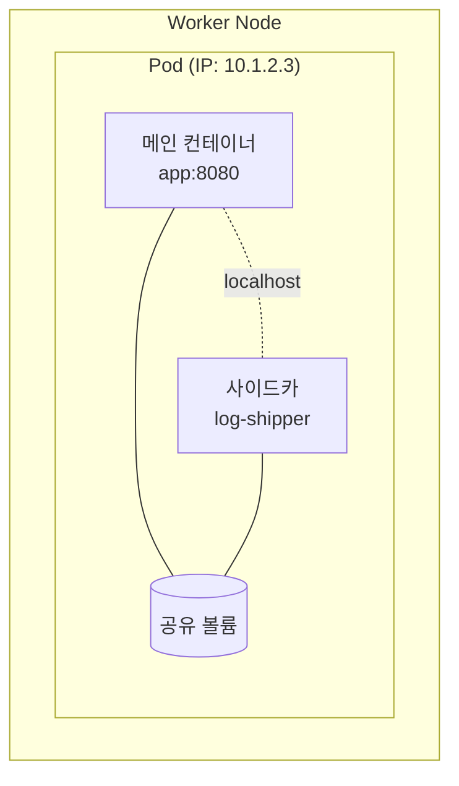
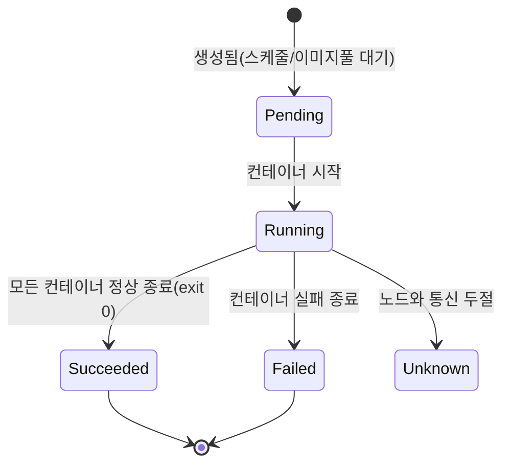

Ch2에서 클러스터의 부품들을 봤습니다. 그 부품들이 결국 **실행하는 대상**이 무엇인지 이번에 정합니다.
직관적으로는 "컨테이너"라고 답하기 쉽지만, Kubernetes의 답은 다릅니다.

> **Kubernetes가 직접 다루는 가장 작은 배포 단위는 컨테이너가 아니라 "Pod"다.**

이 챕터의 목표는 두 가지입니다. ① 왜 컨테이너를 한 겹 더 감싼 Pod라는 개념을 만들었는지,
② 그 Pod가 태어나서 죽기까지 어떻게 동작하는지.

## 왜 필요한가 (Why)

### 컨테이너 하나로는 부족한 순간이 있다

컨테이너의 철학은 "한 컨테이너 = 한 프로세스(한 가지 책임)"입니다. 이 원칙은 좋지만,
현실에는 **두 프로세스가 한 몸처럼 붙어 있어야** 하는 경우가 있습니다.

- 웹 서버 옆에서 로그를 수집해 외부로 보내는 **로그 수집기**
- 앱 옆에서 설정 파일을 주기적으로 갱신해 주는 **설정 동기화기**
- 앱으로 들어오는 트래픽을 가로채 암호화/인증을 처리하는 **프록시(서비스 메시 사이드카)**

이들은 메인 앱과 **같은 네트워크, 같은 디스크 일부, 같은 수명**을 공유해야 자연스럽습니다.
"localhost로 서로 부르고, 같은 파일을 보고, 같이 태어나 같이 죽는" 관계입니다.

만약 Kubernetes가 컨테이너를 직접 스케줄링한다면, 이 두 컨테이너가 **항상 같은 노드에**
배치되고 자원을 공유하도록 매번 따로 보장해야 합니다. 번거롭고 깨지기 쉽습니다.

### 그래서 "함께 살아야 하는 컨테이너들"을 한 봉투에 묶었다

Kubernetes는 "**언제나 함께 배치되고, 자원을 공유하며, 생명주기를 같이하는 컨테이너들의 묶음**"을
하나의 단위로 정의했습니다. 이게 **Pod**입니다. 스케줄러는 컨테이너가 아니라 **Pod 단위로** 노드에
배치합니다. 그러면 한 Pod 안의 컨테이너들은 자동으로 같은 노드에서, 자원을 공유하며 돌게 됩니다.

비유하자면 컨테이너가 "사람"이라면, Pod는 "한 집에 사는 가족"입니다. 이사(스케줄링)는 집 단위로
가고, 집 안에서는 같은 주소(IP)와 같은 창고(볼륨)를 씁니다.

## 핵심 개념 (What)

### Pod의 정의

- **Pod는 1개 이상의 컨테이너를 담는 실행 단위**입니다. 대부분은 컨테이너 1개지만, 보조 컨테이너를
  함께 담을 수 있습니다.
- 한 Pod 안의 컨테이너들은 다음을 **공유**합니다.
  - **네트워크 네임스페이스**: 같은 Pod IP를 공유. 컨테이너끼리는 `localhost`로 서로를 호출. 포트만
    겹치지 않게 나눠 쓰면 됩니다.
  - **스토리지(볼륨)**: 같은 볼륨을 마운트해 파일을 주고받을 수 있습니다.
  - **생명주기**: 함께 스케줄링되고, 보통 함께 끝납니다.
- **Pod는 일회용(ephemeral)** 입니다. 죽으면 "고쳐지는" 게 아니라 **버려지고 새로 만들어집니다.**
  새 Pod는 새 IP를 받습니다. (이 성질이 Ch5 네트워킹의 출발점이 됩니다.)

### 한 컨테이너 vs 여러 컨테이너 Pod

- **단일 컨테이너 Pod** (가장 흔함): 앱 하나 = Pod 하나. 단순하고 명확.
- **다중 컨테이너 Pod**: 메인 컨테이너 + 그를 돕는 보조 컨테이너. 단, 보조 컨테이너가 메인과
  **수명·자원을 정말 함께해야 할 때만** 묶습니다. 단순히 "관련 있다"는 이유로 묶으면 안 됩니다
  (그건 별도 Pod로 두고 Service로 통신).

## 어떻게 동작하는가 (How)

### Pod 라이프사이클 — phase

Pod는 생애 동안 몇 가지 **phase(단계)** 를 지납니다.

- **Pending**: Pod가 받아들여졌지만 아직 실행 전. 노드 배정 대기 또는 이미지 다운로드 중.
- **Running**: 노드에 배치되어 컨테이너가 최소 하나 돌고 있음.
- **Succeeded**: 모든 컨테이너가 성공적으로 종료(주로 배치 작업, Job).
- **Failed**: 컨테이너가 실패로 종료.
- **Unknown**: 노드와 연결이 끊겨 상태를 알 수 없음.

### init 컨테이너 — 본 컨테이너보다 "먼저, 순서대로"

메인 컨테이너가 뜨기 전에 **준비 작업**(예: DB 마이그레이션, 설정 다운로드, 의존 서비스 대기)을
해야 할 때 **init 컨테이너**를 씁니다.

- init 컨테이너는 **정의된 순서대로 하나씩** 실행되고, **모두 성공해야** 메인 컨테이너가 시작됩니다.
- 하나라도 실패하면 Kubernetes가 Pod를 재시작 정책에 따라 다시 시도합니다.

### 재시작 정책(restartPolicy)

컨테이너가 죽었을 때의 행동을 정합니다: `Always`(기본, 항상 재시작), `OnFailure`(실패 시만),
`Never`(재시작 안 함). 재시작은 **같은 Pod 안에서 컨테이너만** 다시 띄우는 것입니다.
Pod 자체가 사라지면 그건 "재시작"이 아니라 (컨트롤러에 의한) "새 Pod 생성"입니다 — 구분이 중요합니다.

### 사이드카 패턴(sidecar)

다중 컨테이너 Pod의 대표 활용입니다. 메인 컨테이너의 기능을 **건드리지 않고 보강**하는 보조
컨테이너를 옆에 붙입니다.

- **로깅 사이드카**: 앱이 파일에 쓴 로그를 공유 볼륨에서 읽어 외부로 전송.
- **프록시 사이드카**: 들어오고 나가는 트래픽을 가로채 암호화·인증·관측(서비스 메시).
- **장점**: 메인 앱 코드를 바꾸지 않고 횡단 관심사(로깅·보안·모니터링)를 분리.

> 참고: 최신 Kubernetes(1.28+)는 사이드카를 "재시작 정책이 `Always`인 init 컨테이너"로 선언하는
> **정식 사이드카 지원**을 도입해, 사이드카가 메인보다 먼저 뜨고 나중에 종료되도록 보장합니다.

### "맨몸 Pod"를 직접 만들지 않는 이유

Pod는 일회용이라, 노드가 죽거나 Pod가 사라지면 **스스로 되살아나지 않습니다.** 그래서 실무에서
Pod를 직접(맨몸으로) 만들지 않고, **컨트롤러(Deployment 등, Ch4)** 에게 "이 Pod를 항상 N개
유지하라"고 맡깁니다. 그러면 Pod가 죽어도 컨트롤러의 조정 루프가 새로 만들어 줍니다.
즉, **Pod는 "실행 단위"이고, 그 Pod를 "유지·관리"하는 건 컨트롤러의 몫**입니다.

## 트레이드오프

| 선택 | 얻는 것 | 치르는 비용 |
| ---- | ------- | ----------- |
| 컨테이너 대신 Pod를 기본 단위로 | 함께 살아야 할 컨테이너의 공동 배치·자원 공유가 자동 | 추상화가 한 겹 늘어 입문자에게 낯섦 |
| Pod를 일회용으로 설계 | 자가 치유·교체가 단순(고치지 말고 새로 만든다) | IP가 계속 바뀜 → 안정 주소가 별도 필요(Service) |
| 다중 컨테이너 Pod | 횡단 관심사(로깅·프록시) 분리 | 과용 시 Pod가 비대해지고 결합도↑, 독립 확장 불가 |
| 맨몸 Pod 직접 사용 | 가장 단순 | 자가 치유 없음 → 실무에선 거의 안 씀(컨트롤러 사용) |

핵심 판단: **"이 컨테이너들이 정말 한 몸으로 태어나 죽어야 하는가?"** 그렇다면 한 Pod,
아니면 별도 Pod로 나누고 Service로 잇습니다. 같은 Pod에 묶은 컨테이너는 **따로 스케일** 할 수 없습니다
(메인 3개·사이드카 1개 같은 구성 불가 — 항상 세트로 늘어남).

## 사이드 이펙트와 주의점

- **Pod IP는 휘발성**: Pod가 재생성되면 IP가 바뀝니다. 절대 Pod IP를 하드코딩하지 마세요.
  안정적 접근은 Service(Ch5)로 해결합니다.
- **재시작 ≠ 재생성**: 컨테이너 재시작은 Pod 안에서 일어나며 같은 Pod·IP 유지. Pod 재생성은
  완전히 새 Pod(새 IP). 로그·임시 파일도 함께 사라집니다.
- **컨테이너 간 시작 순서 의존**: 일반 컨테이너끼리는 시작 순서가 보장되지 않습니다. 순서가
  필요하면 init 컨테이너나 정식 사이드카(1.28+)를 쓰세요.
- **공유 볼륨의 수명**: Pod에 붙는 기본 볼륨(emptyDir 등)은 **Pod가 사라지면 함께 사라집니다.**
  영구 저장이 필요하면 PV/PVC(Ch7)를 써야 합니다.
- **사이드카 과용**: "편하니까" 컨테이너를 자꾸 묶으면 Pod가 무거워지고 장애 격리·독립 확장이
  어려워집니다. 정말 한 몸이어야 할 때만 묶으세요.
- **하나의 컨테이너 실패가 Pod 전체에 영향**: 재시작 정책과 probe 설정(Ch9)에 따라 Pod의 가용성이
  좌우됩니다.

## 용어 정리

| 용어 | 설명 |
| ---- | ---- |
| Pod | 함께 배치·자원 공유·생명주기를 같이하는 1개 이상 컨테이너의 묶음. K8s의 최소 배포 단위 |
| 네트워크 네임스페이스 공유 | 한 Pod 내 컨테이너가 같은 IP를 쓰고 `localhost`로 통신하는 성질 |
| 볼륨(Volume) | Pod 내 컨테이너가 공유·사용하는 저장 공간. 종류에 따라 수명이 다름 |
| ephemeral(일회용) | Pod가 고쳐지지 않고 버려진 뒤 새로 생성되는 성질 |
| phase | Pod의 생애 단계: Pending / Running / Succeeded / Failed / Unknown |
| Pending / Running | 실행 대기 상태 / 컨테이너가 실제로 도는 상태 |
| init 컨테이너 | 메인 컨테이너보다 먼저, 순서대로 실행되어 준비 작업을 하는 컨테이너 |
| restartPolicy | 컨테이너 종료 시 재시작 규칙: Always / OnFailure / Never |
| 사이드카(sidecar) | 메인 컨테이너를 보강하는 보조 컨테이너(로깅·프록시 등) |
| 맨몸 Pod(bare Pod) | 컨트롤러 없이 직접 만든 Pod. 자가 치유가 없어 실무에서 지양 |
| 컨트롤러(Controller) | Pod를 원하는 개수·상태로 유지·관리하는 상위 객체(Ch4) |

---

다음 챕터(Ch 4)에서는 이 일회용 Pod를 **"항상 원하는 만큼 유지"** 하게 만드는 주체 —
**컨트롤러와 선언적 관리(ReplicaSet / Deployment, 롤링 업데이트)** 로 들어갑니다.

## 공식 문서 참고

- [Pod](https://kubernetes.io/docs/concepts/workloads/pods/)
- [Pod 라이프사이클](https://kubernetes.io/docs/concepts/workloads/pods/pod-lifecycle/)
- [Init 컨테이너](https://kubernetes.io/docs/concepts/workloads/pods/init-containers/)
