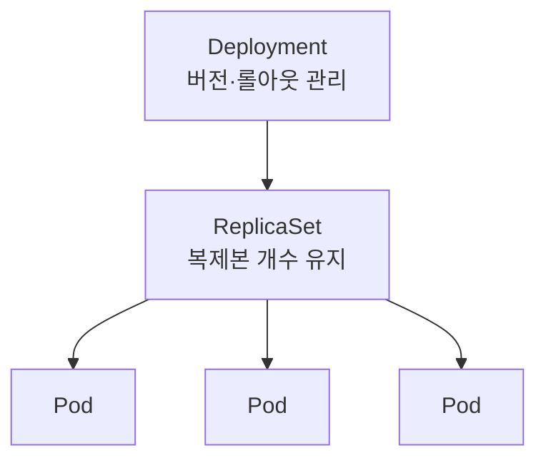
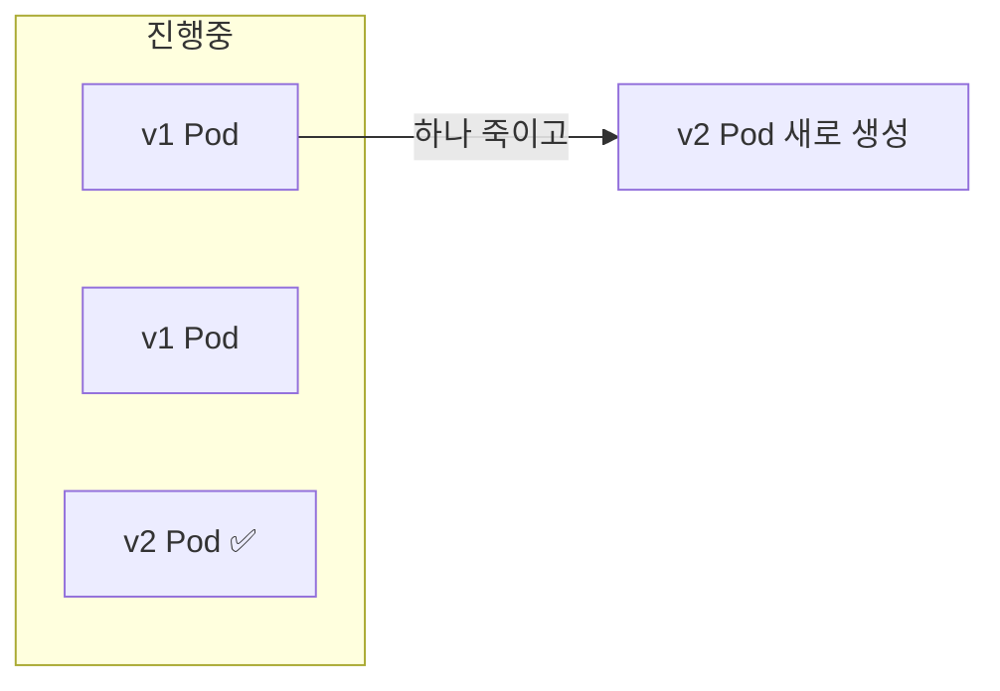

Ch3에서 Pod는 일회용이라 스스로 되살아나지 않는다고 했습니다. 그래서 실무에선 Pod를 직접 만들지
않고 **컨트롤러**에게 맡긴다고 예고했죠. 이번 챕터가 바로 그 컨트롤러 이야기입니다.

> **핵심: 당신은 "어떻게"가 아니라 "무엇을 원하는지"만 선언한다. 나머지는 컨트롤러가 맞춘다.**

## 왜 필요한가 (Why)

### 명령형으로 운영하면 무너지는 지점

명령형(imperative)은 "이걸 켜, 하나 더 켜, 이건 꺼"처럼 **행동을 일일이 지시**합니다. 문제는:

- Pod가 죽으면 누군가 알아채고 **수동으로** 다시 띄워야 합니다.
- 복제본을 5개로 늘리려면 현재 몇 개인지 세고 차이만큼 명령해야 합니다.
- 새 버전 배포 시 "구버전 끄고 신버전 켜는" 순서를 사람이 조율하다 사고가 납니다.

규모가 커지면 사람이 현재 상태를 추적하는 것 자체가 불가능해집니다.

### 선언형 + 컨트롤러가 푸는 방식

선언형(declarative)은 **원하는 결과(Desired State)** 만 적습니다. "이 앱을 항상 3개 유지하라."
그러면 컨트롤러의 **조정 루프**(Ch1)가 현재 상태를 관찰하고, 원하는 상태와 비교하고, 차이를
스스로 메웁니다. Pod가 죽어 2개가 되면 1개를 새로 만들어 3개로 복구합니다.


## 핵심 개념 (What)

### 객체 계층: Deployment → ReplicaSet → Pod

실무에서 앱을 배포할 때 직접 다루는 건 보통 **Deployment**입니다. 내부 구조는 3층입니다.



- **ReplicaSet**: "이 템플릿의 Pod를 정확히 N개 유지"만 책임집니다. 개수 보장이 전부입니다.
- **Deployment**: ReplicaSet 위에서 **버전(롤아웃/롤백)** 을 관리합니다. 새 버전을 배포하면
  새 ReplicaSet을 만들어 점진적으로 교체합니다. 보통 우리는 Deployment만 만지고 ReplicaSet은
  Deployment가 알아서 다룹니다.

### 라벨과 셀렉터 — 컨트롤러가 Pod를 알아보는 법

컨트롤러는 Pod를 이름으로 추적하지 않습니다. **라벨(label)** 이라는 key-value 태그를 Pod에 붙이고,
컨트롤러는 **셀렉터(selector)** 로 "이 라벨을 가진 Pod"를 자기 소유로 인식합니다. 느슨한 결합의 핵심
장치이며, Service(Ch5)도 같은 방식으로 Pod를 찾습니다.

## 어떻게 동작하는가 (How)

### 선언 예시

```yaml filename="deployment.yaml"
apiVersion: apps/v1
kind: Deployment
metadata:
  name: web
spec:
  replicas: 3              # 원하는 복제본 수
  selector:
    matchLabels:
      app: web             # 이 라벨의 Pod를 내 것으로 인식
  template:                # 만들 Pod의 설계도
    metadata:
      labels:
        app: web
    spec:
      containers:
        - name: web
          image: myapp:1.0
```

이 한 장을 `apply`하면, Deployment → ReplicaSet → Pod 3개가 만들어지고, 이후 어떤 Pod가 죽어도
ReplicaSet이 3개를 유지합니다.

### 롤링 업데이트 — 무중단 버전 교체

이미지를 `myapp:1.0` → `myapp:2.0`으로 바꿔 `apply`하면, Deployment는 **새 ReplicaSet**을 만들어
구버전 Pod를 **조금씩** 신버전으로 교체합니다. 한 번에 다 바꾸지 않으므로 서비스가 끊기지 않습니다.



교체 속도는 두 손잡이로 조절합니다.

- **maxUnavailable**: 롤아웃 중 동시에 죽여도 되는 최대 Pod 수(가용성 하한).
- **maxSurge**: 원하는 개수를 초과해 임시로 더 띄울 수 있는 최대 Pod 수(교체 속도).

### 롤백

새 버전에 문제가 생기면, Deployment는 이전 ReplicaSet을 그대로 보관하고 있으므로 **즉시 롤백**할
수 있습니다. "버전을 ReplicaSet 단위로 기억한다"는 설계 덕분입니다.

### 다른 워크로드 컨트롤러

Deployment는 stateless 앱용입니다. 용도별로 다른 컨트롤러가 있습니다.

- **StatefulSet**: 안정적 식별자·순서·스토리지가 필요한 상태 저장 앱(Ch7).
- **DaemonSet**: 모든(또는 특정) 노드에 Pod를 1개씩(로그 수집기·모니터링 에이전트 등).
- **Job / CronJob**: 끝나는 배치 작업 / 주기적 배치 작업.

## 트레이드오프

| 선택 | 얻는 것 | 치르는 비용 |
| ---- | ------- | ----------- |
| 선언형 + 컨트롤러 | 자가 치유, 재현성, GitOps 친화 | "즉시"가 아니라 "결국" 수렴(약간의 지연) |
| Deployment(롤링) | 무중단 배포·즉시 롤백 | 롤아웃 중 두 버전이 잠시 공존(호환성 필요) |
| 라벨/셀렉터 결합 | 느슨한 결합, 유연 | 라벨 오타·중복 시 엉뚱한 Pod를 관리하는 사고 |
| maxSurge↑ (빠른 교체) | 배포 속도↑ | 일시적 자원 사용량 급증 |
| maxUnavailable↑ | 자원 절약·빠름 | 롤아웃 중 가용 용량 감소 → 트래픽 처리력↓ |

핵심 판단은 **배포 속도 vs 가용성/자원**의 균형입니다. 트래픽이 민감하면 `maxUnavailable: 0`으로
가용성을 지키고 `maxSurge`로 속도를 냅니다.

## 사이드 이펙트와 주의점

- **롤아웃 중 두 버전 공존**: 구·신 버전이 동시에 트래픽을 받습니다. DB 스키마·API 계약이 양쪽과
  호환되어야 합니다(특히 마이그레이션 주의).
- **셀렉터 변경은 위험**: Deployment의 `selector`는 사실상 불변으로 다뤄야 합니다. 바꾸면 기존 Pod를
  놓치거나 고아 ReplicaSet이 생깁니다.
- **"결국 수렴" 지연**: `apply` 직후 곧바로 반영됐다고 가정하면 깨집니다. `rollout status`로 완료를
  확인하세요.
- **probe 없으면 헛도는 롤아웃**: readiness probe(Ch9)가 없으면 아직 준비 안 된 신버전 Pod로
  트래픽이 가서 순간 장애가 납니다. 무중단 배포의 전제는 probe입니다.
- **고아 리소스**: 라벨이 겹치는 두 컨트롤러가 같은 Pod를 두고 다툴 수 있습니다. 라벨 네이밍 규칙을
  엄격히 가져가세요.
- **replicas를 GitOps와 HPA가 동시에 건드리면 충돌**: 자동 스케일링(Ch9)을 쓸 땐 매니페스트의
  `replicas`를 고정하지 않도록 주의합니다.

## 용어 정리

| 용어 | 설명 |
| ---- | ---- |
| Desired State | 사용자가 선언한 목표 상태(예: 복제본 3개) |
| 조정 루프 | 현재 상태를 Desired State와 비교해 차이를 메우는 반복 과정 |
| ReplicaSet | Pod를 정확히 N개 유지하는 컨트롤러 |
| Deployment | ReplicaSet 위에서 버전(롤아웃·롤백)을 관리하는 컨트롤러 |
| 라벨(Label) | 객체에 붙이는 key-value 태그 |
| 셀렉터(Selector) | 특정 라벨을 가진 객체를 골라내는 조건 |
| 롤링 업데이트 | Pod를 조금씩 교체해 무중단으로 새 버전을 배포 |
| maxUnavailable | 롤아웃 중 동시에 사용 불가해도 되는 최대 Pod 수 |
| maxSurge | 원하는 개수를 초과해 임시로 더 띄울 수 있는 최대 Pod 수 |
| 롤백(Rollback) | 이전 ReplicaSet(버전)으로 되돌리는 것 |
| StatefulSet / DaemonSet / Job | 상태 저장 / 노드별 1개 / 배치 작업용 워크로드 컨트롤러 |

---

다음 챕터(Ch 5)에서는 이렇게 늘었다 줄었다 하는 Pod들을 **안정적인 주소로 찾아 통신**하게 만드는
**네트워킹과 서비스 디스커버리**로 들어갑니다.
