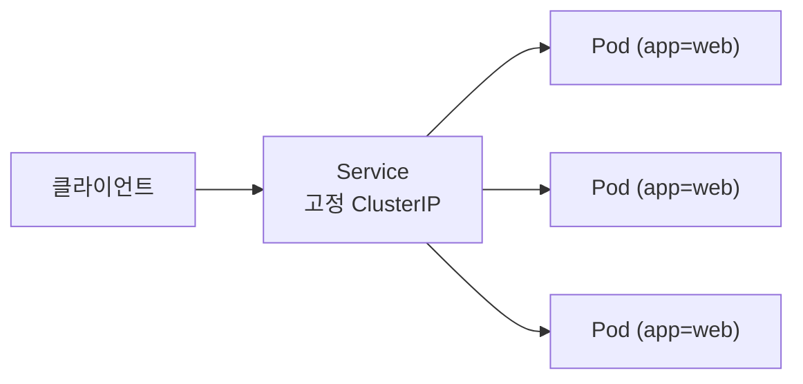
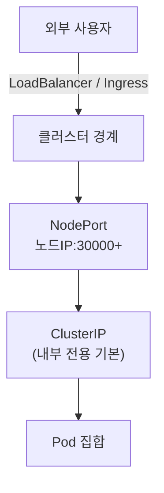
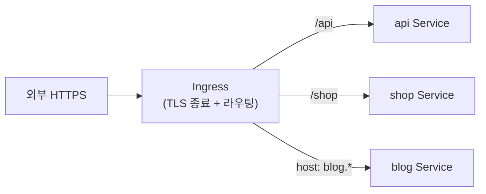

Ch4에서 Pod는 롤아웃·자가 치유로 끊임없이 생기고 사라진다고 했습니다. 그런데 Ch3에서 봤듯
**Pod IP는 재생성마다 바뀝니다.** 그렇다면 클라이언트는 도대체 어떤 주소로 접속해야 할까요?
이 모순을 푸는 것이 이번 챕터입니다.

> **핵심: Pod는 휘발성이지만, Service는 그 앞에 놓인 "변하지 않는 주소"다.**

## 왜 필요한가 (Why)

### 움직이는 표적 문제

- Pod IP는 수시로 바뀐다(재시작·스케일·노드 이동).
- 복제본이 3개면 IP도 3개. 클라이언트가 어느 것으로 가야 하나? 부하 분산은?
- 외부 사용자는 클러스터 내부 IP에 접근조차 못 한다.

IP를 하드코딩하는 순간 시스템은 깨집니다. **안정된 가상 주소 + 자동 부하분산 + 이름으로 찾기**가
필요합니다.

## 핵심 개념 (What)

### Service — 변하지 않는 주소와 부하분산

**Service**는 "같은 라벨을 가진 Pod 집합" 앞에 놓이는 **안정적 가상 엔드포인트**입니다.
Service는 셀렉터로 대상 Pod들을 추적하고(Endpoints), 들어온 트래픽을 그 Pod들에 분산합니다.
Pod가 죽고 새로 떠도 Service의 IP/이름은 그대로입니다.

실제 트래픽 전달은 각 노드의 **kube-proxy**(Ch2)가 만든 네트워크 규칙이 담당합니다.

### 클러스터 DNS — 이름으로 찾기

클러스터에는 내장 DNS(CoreDNS)가 있어, Service에 **이름**을 부여합니다. 그래서 IP가 아니라
이름으로 호출합니다.

- 같은 네임스페이스: `http://web`
- 다른 네임스페이스: `http://web.other-namespace`
- 정식(FQDN): `web.other-namespace.svc.cluster.local`

이것이 **서비스 디스커버리**입니다. 앱은 IP를 몰라도 "web"이라는 이름만 알면 됩니다.

## 어떻게 동작하는가 (How)

### Service 타입 — 노출 범위가 다르다

- **ClusterIP** (기본): 클러스터 **내부에서만** 접근 가능한 가상 IP. 내부 서비스 간 통신용.
- **NodePort**: 모든 노드의 특정 포트(기본 30000~32767)를 열어 **외부에서** `노드IP:포트`로 접근.
  단순하지만 포트 관리가 번거롭고 운영용으론 투박함.
- **LoadBalancer**: 클라우드의 외부 로드밸런서를 자동 프로비저닝해 **공인 IP**를 부여. 클라우드
  환경에서 외부 노출의 표준. 단, Service마다 LB가 하나씩 생겨 비용↑.
- (참고) **Headless Service**: ClusterIP를 안 만들고 각 Pod의 DNS를 직접 노출. StatefulSet(Ch7)에서 사용.

### Ingress — L7 라우팅으로 여러 서비스를 하나의 입구로

Service가 L4(IP/포트) 수준이라면, **Ingress**는 L7(HTTP) 수준에서 **호스트/경로 기반 라우팅**을
제공합니다. 하나의 진입점(보통 LB 하나)으로 여러 서비스를 분기하고, TLS 종료(HTTPS)도 담당합니다.

중요한 점: Ingress는 **규칙(선언)** 일 뿐이고, 실제로 트래픽을 처리하는 건 **Ingress Controller**
(nginx, Traefik 등)입니다. 컨트롤러를 설치하지 않으면 Ingress 객체는 아무 일도 하지 않습니다.

> 참고: 더 일반적인 차세대 표준으로 **Gateway API**가 등장해 Ingress의 한계(표현력·역할 분리)를
> 보완하고 있습니다. 개념은 동일하게 "선언적 L7 라우팅"입니다.

## 트레이드오프

| 선택 | 얻는 것 | 치르는 비용 |
| ---- | ------- | ----------- |
| ClusterIP | 단순·안전(내부 전용) | 외부 노출 불가 |
| NodePort | 외부 노출이 가장 단순 | 포트 범위 제약, LB·TLS 없음, 투박 |
| LoadBalancer | 클라우드 통합·공인 IP | Service마다 LB → 비용·관리 증가 |
| Ingress(+Controller) | 입구 하나로 다중 서비스·TLS·경로 라우팅 | 컨트롤러 운영 부담, 설정 복잡도 |
| DNS 이름 기반 호출 | IP 비의존, 느슨한 결합 | DNS 캐시·전파 지연 가능성 |

핵심: **외부 노출은 보통 LoadBalancer 1개 + Ingress**로 모아 비용과 복잡도를 줄입니다.
내부 통신은 ClusterIP + DNS로 충분합니다.

## 사이드 이펙트와 주의점

- **Pod IP 하드코딩 금지**: 반드시 Service 이름으로 접근. IP는 언제든 바뀝니다.
- **Service도 즉시가 아니다**: 새 Pod가 Endpoints에 등록되려면 readiness probe(Ch9)를 통과해야
  합니다. probe가 없으면 준비 안 된 Pod로 트래픽이 가 순간 오류가 납니다.
- **Ingress Controller 미설치 함정**: Ingress만 만들고 컨트롤러가 없으면 동작하지 않습니다(흔한 실수).
- **DNS 캐시·ndots**: 앱/언어 런타임의 DNS 캐싱, `ndots` 설정 때문에 해석이 느리거나 예상과 다를 수
  있습니다. 외부 도메인 조회가 느려지는 흔한 원인.
- **NodePort 보안**: 모든 노드에 포트를 여는 것이라 노출 범위·방화벽을 신경 써야 합니다.
- **세션 고정 필요 시**: 기본은 라운드로빈 분산이라 상태 의존 앱은 sessionAffinity나 외부 세션
  저장소가 필요합니다.
- **네트워크 정책과 별개**: Service는 "연결"을 제공할 뿐, "차단"은 NetworkPolicy(Ch10)의 몫입니다.

## 용어 정리

| 용어 | 설명 |
| ---- | ---- |
| Service | Pod 집합 앞의 안정적 가상 엔드포인트. 부하분산 제공 |
| Endpoints | Service가 트래픽을 보낼 실제 Pod 주소 목록 |
| ClusterIP | 클러스터 내부 전용 가상 IP(기본 Service 타입) |
| NodePort | 모든 노드의 특정 포트로 외부 노출하는 Service 타입 |
| LoadBalancer | 클라우드 외부 LB로 공인 IP를 부여하는 Service 타입 |
| Headless Service | ClusterIP 없이 Pod별 DNS를 노출(StatefulSet용) |
| 클러스터 DNS(CoreDNS) | Service 이름을 IP로 해석해 주는 내장 DNS |
| 서비스 디스커버리 | IP 대신 이름으로 서비스를 찾는 메커니즘 |
| Ingress | 호스트/경로 기반 L7 라우팅·TLS 종료 규칙(선언) |
| Ingress Controller | Ingress 규칙을 실제로 처리하는 구현체(nginx 등) |
| Gateway API | Ingress를 잇는 차세대 L7 라우팅 표준 |
| FQDN | `svc.namespace.svc.cluster.local` 형태의 정식 이름 |

---

다음 챕터(Ch 6)에서는 이 앱들이 환경마다 달라지는 **설정과 비밀(ConfigMap·Secret)** 을 코드와
어떻게 분리해 주입하는지로 들어갑니다.

## 공식 문서 참고

- [Service](https://kubernetes.io/docs/concepts/services-networking/service/)
- [Pod와 Service를 위한 DNS](https://kubernetes.io/docs/concepts/services-networking/dns-pod-service/)
- [Ingress](https://kubernetes.io/docs/concepts/services-networking/ingress/)
