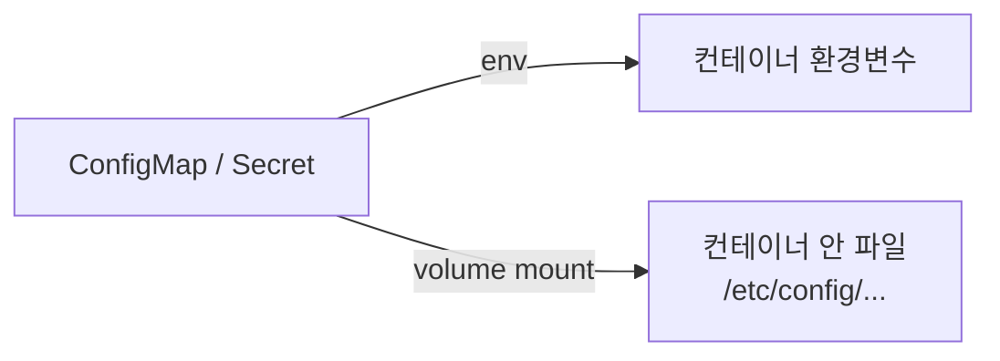

같은 컨테이너 이미지가 개발·스테이징·운영에서 **다르게 동작**해야 합니다. DB 주소도, 로그 레벨도,
API 키도 환경마다 다릅니다. 그렇다고 환경마다 이미지를 따로 굽는 건 컨테이너의 이식성을 버리는
일입니다. 이 챕터는 "이미지는 하나, 설정은 바깥에서"를 어떻게 구현하는지 다룹니다.

> **핵심: 설정은 코드(이미지)가 아니라 환경에 속한다. 이미지는 한 번 굽고, 설정은 주입한다.**

## 왜 필요한가 (Why)

### 12-factor의 Config 원칙

12-factor 앱 방법론은 **"설정을 코드에서 엄격히 분리하라"** 고 말합니다. 이유는:

- **이식성**: 같은 이미지를 어느 환경에든 올릴 수 있어야 한다.
- **보안**: 비밀번호·키를 이미지나 git에 박으면 유출 위험이 영구적이다.
- **변경 용이**: 설정을 바꾸려고 이미지를 다시 굽고 배포하는 건 과하다.

그래서 설정을 **클러스터의 별도 객체**로 두고 Pod에 주입합니다. 두 객체가 있습니다:
일반 설정은 **ConfigMap**, 민감 정보는 **Secret**.

## 핵심 개념 (What)

### ConfigMap — 민감하지 않은 설정

key-value 형태의 설정 묶음입니다. 로그 레벨, 기능 플래그, 외부 URL, 설정 파일 전체 등을 담습니다.

```yaml filename="configmap.yaml"
apiVersion: v1
kind: ConfigMap
metadata:
  name: web-config
data:
  LOG_LEVEL: "info"
  FEATURE_NEW_UI: "true"
  app.properties: |
    cache.ttl=60
    page.size=20
```

### Secret — 민감 정보

비밀번호, API 키, 인증서, 토큰처럼 노출되면 안 되는 값입니다. 형태는 ConfigMap과 비슷하지만
용도와 취급이 다릅니다.

```yaml filename="secret.yaml"
apiVersion: v1
kind: Secret
metadata:
  name: db-secret
type: Opaque
stringData:        # 평문으로 적으면 저장 시 base64로 인코딩됨
  DB_PASSWORD: "s3cr3t"
```

> **중요한 오해 정정**: Secret은 기본적으로 **암호화가 아니라 base64 "인코딩"** 일 뿐입니다.
> base64는 누구나 디코딩할 수 있습니다. 진짜 보안을 위해선 별도 설정이 필요합니다(아래 주의점).

## 어떻게 동작하는가 (How)

### 주입 방식 1 — 환경변수

ConfigMap/Secret의 값을 컨테이너의 환경변수로 넣습니다. 가장 흔한 방식.

```yaml filename="deployment-env.yaml"
spec:
  containers:
    - name: web
      image: myapp:1.0
      env:
        - name: LOG_LEVEL
          valueFrom:
            configMapKeyRef: { name: web-config, key: LOG_LEVEL }
        - name: DB_PASSWORD
          valueFrom:
            secretKeyRef: { name: db-secret, key: DB_PASSWORD }
```

### 주입 방식 2 — 볼륨 마운트(파일)

ConfigMap/Secret을 파일로 마운트합니다. 설정 **파일 전체**나 인증서처럼 파일이어야 하는 값에 적합.



두 방식의 결정적 차이: **환경변수는 컨테이너 시작 시점에 고정**되어 이후 ConfigMap을 바꿔도
반영되지 않습니다(재시작 필요). 반면 **볼륨 마운트는 갱신이 파일에 전파**됩니다(앱이 다시 읽어야 함).

## 트레이드오프

| 선택 | 얻는 것 | 치르는 비용 |
| ---- | ------- | ----------- |
| 설정 외부화(ConfigMap/Secret) | 이식성·보안·변경 용이 | 객체가 늘고 관리 포인트 증가 |
| 환경변수 주입 | 단순·앱 호환성 좋음 | 변경 반영에 Pod 재시작 필요, 값이 로그·에러에 노출되기 쉬움 |
| 볼륨 마운트 주입 | 동적 갱신, 파일/인증서에 적합 | 앱이 파일 변경을 감지·재로딩해야 함 |
| 기본 Secret | 도입 간단 | base64일 뿐 → 진짜 암호화 아님 |
| 외부 비밀 관리(Vault/KMS 연동) | 강한 보안·회전·감사 | 인프라·운영 복잡도 추가 |

핵심: **민감도와 변경 빈도**로 고른다. 자주 바뀌고 파일이어야 하면 볼륨, 단순 값이면 환경변수.
진짜 비밀이라면 기본 Secret을 넘어 암호화·외부 비밀관리로 가야 한다.

## 사이드 이펙트와 주의점

- **Secret ≠ 암호화**: 기본은 base64 인코딩. etcd 저장 시 암호화하려면 **EncryptionConfiguration**을
  켜고, RBAC(Ch10)로 접근을 제한하며, 가능하면 외부 비밀관리(Vault, 클라우드 KMS/Secrets Manager)와
  연동해야 합니다.
- **git에 Secret 커밋 금지**: GitOps(Ch12)에서 평문 Secret을 올리면 영구 유출입니다. SOPS,
  Sealed Secrets, External Secrets 같은 암호화/참조 방식을 씁니다.
- **환경변수는 새 나가기 쉽다**: 크래시 덤프·로그·`/proc`·자식 프로세스로 노출될 수 있습니다.
  민감값은 볼륨 마운트가 더 안전한 경우가 많습니다.
- **변경이 자동 반영 안 됨(env)**: ConfigMap을 바꿔도 환경변수 주입 Pod는 그대로입니다. 롤아웃을
  유발하려면 체크섬을 애너테이션에 넣는 등 트릭이 필요합니다.
- **볼륨 갱신 지연**: 마운트된 ConfigMap 갱신은 즉시가 아니라 kubelet 동기화 주기만큼 지연됩니다.
- **크기 제한**: ConfigMap/Secret은 1MiB 제한이 있습니다. 큰 데이터는 다른 저장소를 쓰세요.

## 용어 정리

| 용어 | 설명 |
| ---- | ---- |
| ConfigMap | 민감하지 않은 설정을 담는 key-value 객체 |
| Secret | 비밀번호·키 등 민감 정보를 담는 객체(기본은 base64 인코딩) |
| 12-factor Config | 설정을 코드와 엄격히 분리하라는 원칙 |
| 환경변수 주입 | ConfigMap/Secret 값을 컨테이너 env로 넣는 방식 |
| 볼륨 마운트 주입 | 설정을 파일로 컨테이너에 마운트하는 방식 |
| base64 | 암호화가 아닌 인코딩. 누구나 디코딩 가능 |
| EncryptionConfiguration | etcd에 저장되는 Secret을 암호화하는 설정 |
| 외부 비밀관리 | Vault·KMS·Secrets Manager 등 클러스터 밖 비밀 저장소 연동 |
| Sealed Secrets / SOPS / External Secrets | git에 안전하게 비밀을 다루기 위한 도구들 |

---

다음 챕터(Ch 7)에서는 컨테이너가 사라져도 **데이터가 살아남게** 하는 스토리지와 상태 관리
(Volume, PV/PVC, StatefulSet)로 들어갑니다.
