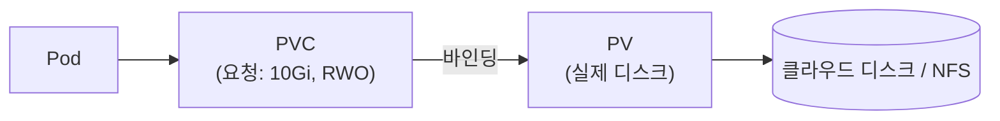
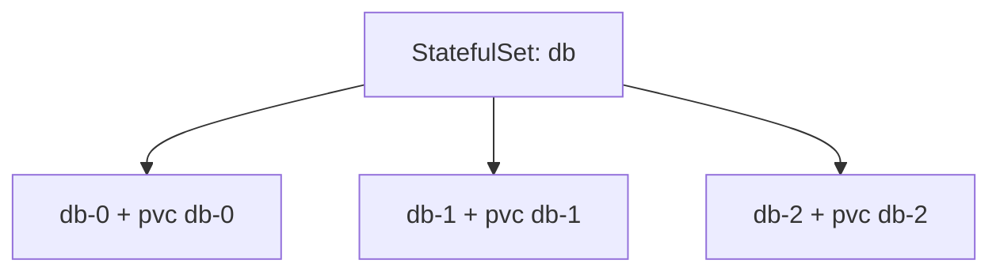

지금까지의 워크로드는 대부분 **stateless**였습니다. 죽으면 새로 만들면 그만이었죠. 하지만 데이터베이스,
메시지 큐, 파일 저장소처럼 **데이터를 기억해야 하는** 앱은 다릅니다. Pod가 사라지면 데이터도 사라지면
안 됩니다. 이 챕터는 일회용 Pod 위에서 영속성을 확보하는 방법을 다룹니다.

> **핵심: 데이터의 수명을 Pod의 수명에서 떼어낸다.**

## 왜 필요한가 (Why)

### 컨테이너 파일시스템은 사라진다

컨테이너의 쓰기 가능한 레이어와 Pod 기본 볼륨(emptyDir)은 **Pod가 사라지면 함께 소멸**합니다.
재시작·롤아웃·노드 이동이 일상인 Kubernetes에서, 데이터를 컨테이너 안에 두는 건 곧 데이터 분실입니다.

게다가 상태 저장 앱은 stateless 앱과 요구가 다릅니다.

- **영속성**: Pod가 죽어도 데이터가 남아야 한다.
- **안정적 정체성**: 복제본 0번은 항상 0번이어야 한다(주/부 구분, 클러스터 멤버십).
- **고유 스토리지**: 각 복제본이 자기만의 디스크를 가져야 한다(공유하면 안 되는 경우가 많다).
- **순서**: 시작·종료에 순서가 필요할 수 있다(예: 0번 먼저).

## 핵심 개념 (What)

### Volume — Pod 수명에 묶인 저장소

Pod 안 컨테이너들이 공유하는 저장 공간입니다. 종류에 따라 수명이 다릅니다. `emptyDir`은 Pod와
함께 사라지고, 영속 저장은 아래 PV로 연결합니다.

### PV / PVC — 영속 스토리지의 공급과 요청

영속성의 핵심은 **공급(provider)과 요청(consumer)의 분리**입니다.

- **PV(PersistentVolume)**: 클러스터에 존재하는 **실제 저장 공간**(클라우드 디스크, NFS 등). 인프라/관리자 관점의 자원.
- **PVC(PersistentVolumeClaim)**: 앱이 "이만큼의 저장소를 이런 모드로 달라"고 내는 **요청서**. 개발자 관점.

PVC가 조건에 맞는 PV에 **바인딩**되면, Pod는 PVC를 통해 그 저장소를 마운트합니다.

### StorageClass — 동적 프로비저닝

PV를 관리자가 미리 일일이 만들어 두는 건 번거롭습니다. **StorageClass**는 "이런 종류의 디스크를
필요할 때 자동으로 만들어라"는 템플릿입니다. PVC가 StorageClass를 지정하면, 바인딩할 PV가 없을 때
**프로비저너가 PV를 즉석에서 생성**합니다(동적 프로비저닝). 오늘날 가장 일반적인 방식입니다.

### 접근 모드(Access Mode)

- **RWO(ReadWriteOnce)**: 한 노드에서만 읽기·쓰기(대부분의 블록 디스크).
- **ROX(ReadOnlyMany)**: 여러 노드에서 읽기 전용.
- **RWX(ReadWriteMany)**: 여러 노드에서 동시 읽기·쓰기(NFS 등 일부만 지원).

## 어떻게 동작하는가 (How)

### StatefulSet — 상태 저장 앱을 위한 컨트롤러

Deployment(Ch4)는 Pod를 **동등하고 교체 가능한** 것으로 다룹니다. 이름도 랜덤이고 스토리지도
공유 템플릿입니다. 상태 저장 앱엔 맞지 않습니다. **StatefulSet**은 다르게 동작합니다.

- **안정적 이름**: `db-0`, `db-1`, `db-2`처럼 **고정된 순서 이름**. 재생성돼도 이름 유지.
- **고유 스토리지**: `volumeClaimTemplates`로 **각 복제본마다 자기 PVC**를 자동 생성. db-0은 항상
  자기 디스크에 다시 붙습니다.
- **순서 보장**: 생성은 0→1→2, 삭제는 역순으로 진행(옵션).
- **안정적 네트워크 정체성**: Headless Service(Ch5)와 함께 각 Pod가 고유 DNS(`db-0.db`)를 가집니다.

### 회수 정책(Reclaim Policy)

PVC를 지우면 연결된 PV의 데이터를 어떻게 할지 정합니다. `Delete`(실제 디스크까지 삭제) 또는
`Retain`(데이터 보존, 수동 정리). 운영 데이터엔 보통 `Retain`이 안전합니다.

## 트레이드오프

| 선택 | 얻는 것 | 치르는 비용 |
| ---- | ------- | ----------- |
| PV/PVC 분리 | 공급(인프라)과 요청(앱)의 관심사 분리·이식성 | 추상화 계층이 늘어 디버깅 복잡 |
| StorageClass 동적 프로비저닝 | PV 수동 생성 불필요, 자동화 | 프로비저너/클라우드 종속, 비용 가시성↓ |
| StatefulSet | 안정적 정체성·고유 스토리지·순서 | 운영 복잡, 스케일·업그레이드가 까다로움 |
| RWX(공유 쓰기) | 여러 Pod가 동시 쓰기 | 지원 스토리지 제한적, 성능·정합성 이슈 |
| 클러스터 안에서 DB 운영 | 인프라 통일·이식성 | 백업·HA·복구 책임을 직접 짐 |

핵심 판단: **"이 상태를 정말 클러스터 안에서 운영해야 하는가?"** 많은 팀이 DB는 매니지드
서비스(RDS 등)로 빼고, 클러스터에는 stateless 워크로드만 두는 전략을 택합니다. 복잡도/위험을
크게 줄이기 때문입니다.

## 사이드 이펙트와 주의점

- **emptyDir·컨테이너 FS는 휘발성**: 영구 데이터는 반드시 PVC로. 이걸 혼동하면 데이터가 사라집니다.
- **RWO는 노드 1개 제약**: RWO 볼륨을 쓰는 Pod는 그 볼륨이 붙은 노드에만 스케줄됩니다. 여러 Pod가
  같은 RWO PVC를 동시에 쓰려 하면 막힙니다.
- **StatefulSet은 스케일다운이 위험**: 복제본을 줄이면 PVC는 보통 남지만, 데이터·클러스터 멤버십
  정합성을 직접 챙겨야 합니다.
- **회수 정책 오설정 = 데이터 영구 삭제**: `Delete`로 두고 PVC를 지우면 실제 디스크가 사라집니다.
  운영 데이터는 `Retain` + 백업이 기본입니다.
- **백업은 Kubernetes가 안 해준다**: PV 스냅샷/백업은 별도 도구(Velero, 클라우드 스냅샷)로
  설계해야 합니다. "클러스터에 있으니 안전"은 착각입니다.
- **존(zone) 고정**: 클라우드 디스크는 특정 가용영역에 묶여, 그 디스크를 쓰는 Pod도 같은 존에만
  스케줄됩니다. 다중 존 설계 시 주의.

## 용어 정리

| 용어 | 설명 |
| ---- | ---- |
| Volume | Pod 내 컨테이너가 공유하는 저장 공간(종류별 수명 상이) |
| emptyDir | Pod와 수명을 같이하는 임시 볼륨(Pod 삭제 시 소멸) |
| PV(PersistentVolume) | 클러스터의 실제 영속 저장 공간(인프라 관점) |
| PVC(PersistentVolumeClaim) | 앱이 저장소를 요청하는 요청서(개발자 관점) |
| 바인딩(Binding) | PVC가 조건에 맞는 PV에 연결되는 것 |
| StorageClass | 필요 시 PV를 자동 생성하는 템플릿(동적 프로비저닝) |
| 동적 프로비저닝 | PVC 요청 시 PV를 즉석에서 만드는 방식 |
| 접근 모드(RWO/ROX/RWX) | 단일 노드 RW / 다중 노드 RO / 다중 노드 RW |
| StatefulSet | 안정적 정체성·고유 스토리지·순서를 보장하는 워크로드 컨트롤러 |
| volumeClaimTemplates | StatefulSet이 복제본마다 PVC를 자동 생성하는 템플릿 |
| 회수 정책(Reclaim Policy) | PVC 삭제 시 PV 데이터 처리 방식(Delete/Retain) |

---

다음 챕터(Ch 8)에서는 이 Pod들이 **어느 노드에, 얼마만큼의 자원으로** 배치될지 결정하는
스케줄링과 리소스 관리로 들어갑니다.
