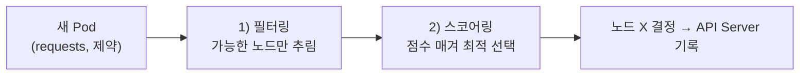
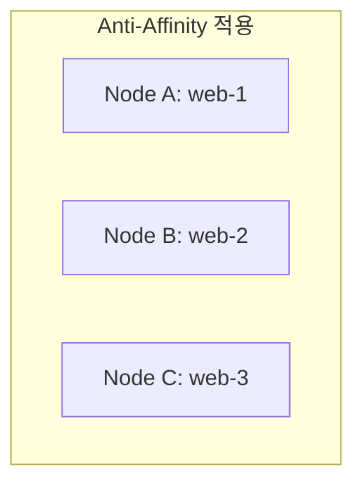

Ch2에서 스케줄러는 "어느 노드에 둘지만 결정한다"고 했습니다. 이번 챕터는 그 결정이 **무엇을 근거로**
이루어지는지, 그리고 우리가 그 결정에 어떻게 개입하는지를 다룹니다. 자원을 너무 빡빡하게 잡으면
앱이 죽고, 너무 헐겁게 잡으면 돈이 샙니다. 그 균형을 잡는 도구들입니다.

> **핵심: 스케줄러는 "필터링(가능한 노드) → 스코어링(가장 좋은 노드)" 2단계로 Pod의 집을 정한다.**

## 왜 필요한가 (Why)

자원 관리를 안 하면 두 가지 재앙이 옵니다.

- **자원 명시 없음 → 무질서**: 한 Pod가 노드의 메모리를 다 먹어 이웃 Pod를 굶기거나 노드를 다운시킵니다.
- **배치 제어 없음 → 비효율·위험**: GPU가 필요한 Pod가 GPU 없는 노드에 가거나, 같은 앱 복제본이
  한 노드에 몰려 그 노드가 죽으면 전부 동시에 죽습니다.

그래서 ① 각 Pod가 **얼마나 쓸지 명시**하고, ② **어디에 둘지 제어**하는 수단이 필요합니다.

## 핵심 개념 (What)

### requests와 limits

컨테이너마다 CPU·메모리를 두 값으로 선언합니다.

- **requests(요청)**: "최소 이만큼은 보장해 달라." **스케줄러는 이 값을 기준으로** 노드를 고릅니다.
  노드의 남은 requests 합이 충분해야 Pod가 들어갑니다.
- **limits(상한)**: "이 이상은 못 쓴다." 런타임이 강제합니다.

```yaml filename="resources.yaml"
resources:
  requests: { cpu: "250m", memory: "256Mi" }   # 스케줄링 기준
  limits:   { cpu: "500m", memory: "512Mi" }   # 사용 상한
```

- **CPU 초과**: 제한(throttle)될 뿐 죽지 않음(압축 가능 자원).
- **메모리 초과**: limit을 넘으면 **OOMKilled**(강제 종료). 메모리는 압축 불가 자원.

### QoS 클래스 — 자원 부족 시 누가 먼저 쫓겨나나

requests/limits 설정에 따라 Pod에 **QoS 등급**이 자동 부여되고, 노드 자원이 부족할 때 **퇴거(evict)
우선순위**가 됩니다.

- **Guaranteed**: 모든 컨테이너가 requests == limits. 가장 늦게 쫓겨남(가장 안전).
- **Burstable**: requests < limits. 중간.
- **BestEffort**: requests/limits 미설정. 가장 먼저 쫓겨남(가장 위험).

## 어떻게 동작하는가 (How)

### 스케줄링 2단계



- **필터링(Filtering)**: requests를 수용 못 하거나, affinity·taint 조건을 못 맞추는 노드를 제외.
- **스코어링(Scoring)**: 남은 후보에 점수를 매겨(자원 여유, 분산 정도 등) 최고점 노드 선택.

### 배치 제어 도구들

#### nodeSelector / Node Affinity — "이런 노드에 가라"

노드에 붙은 라벨(예: `disktype=ssd`, `gpu=true`)을 기준으로 Pod가 갈 노드를 한정합니다.
Node Affinity는 nodeSelector의 표현력 강화판으로 **required**(필수) / **preferred**(선호)를 구분합니다.

#### Pod Affinity / Anti-Affinity — "이 Pod 곁에 / 멀리"

- **Affinity**: 특정 Pod와 같은 노드/존에 모으기(예: 앱과 캐시를 가까이).
- **Anti-Affinity**: 특정 Pod와 떨어뜨리기(예: 같은 앱 복제본을 서로 다른 노드에 분산 → 노드 장애
  내성).



#### Taint와 Toleration — "초대받은 Pod만 들어와"

방향이 반대인 메커니즘입니다.

- **Taint(오염)**: **노드**에 붙이는 "출입 금지" 표식. 기본적으로 모든 Pod를 밀어냅니다.
- **Toleration(용인)**: **Pod**에 붙이는 "그 금지를 견딜 수 있음" 표식.

Taint가 있는 노드엔 그 Taint를 toleration한 Pod만 들어갑니다. 용도: 전용 노드(GPU 전용, Control
Plane 전용)를 특정 워크로드에만 내주기. (Ch2에서 "Control Plane에 일반 워크로드를 안 올린다"고 한 게
바로 이 taint입니다.)

> **Affinity vs Taint 한 줄 구분**: Affinity는 **Pod가 "가고 싶은 곳"** 을 고르는 것,
> Taint는 **노드가 "받기 싫은 것"** 을 막는 것. 둘은 함께 쓰입니다.

## 트레이드오프

| 선택 | 얻는 것 | 치르는 비용 |
| ---- | ------- | ----------- |
| requests를 넉넉히 | 안정성·성능 보장 | 노드 자원 예약↑ → 밀도↓·비용↑ |
| requests를 빡빡히 | 높은 밀도·저비용 | 경합·OOM·throttle 위험↑ |
| limits 설정 | 폭주 격리, 예측 가능 | 너무 낮으면 정상 트래픽도 throttle/OOM |
| Anti-Affinity 분산 | 노드 장애 내성↑ | 배치 제약↑ → 스케줄 실패(Pending) 가능 |
| Taint 전용 노드 | 워크로드 격리·자원 보장 | 노드 활용률↓(노는 전용 노드) |

핵심: **requests==limits(Guaranteed)** 는 가장 안전하지만 비싸고, **느슨한 설정**은 싸지만 위험합니다.
워크로드 중요도에 따라 등급을 나눠 적용하는 게 현실적입니다.

## 사이드 이펙트와 주의점

- **메모리 limit 초과 = OOMKilled**: 메모리는 throttle이 안 됩니다. limit을 넘으면 즉시 강제 종료.
  실제 사용량을 측정(Ch14)해 limit을 정하세요.
- **requests 미설정의 함정**: requests가 없으면 스케줄러가 자원을 0으로 보고 노드에 과밀 배치 →
  실제론 자원이 부족해 줄줄이 OOM/eviction. BestEffort Pod가 가장 먼저 쫓겨납니다.
- **CPU limit의 throttling**: CPU limit이 낮으면 멀쩡한 앱이 주기적으로 멈칫합니다(레이턴시 급증).
  CPU는 limit을 빼고 requests만 두는 전략도 흔합니다.
- **과한 제약 → Pending**: required affinity·anti-affinity·taint가 빡빡하면 조건 맞는 노드가 없어
  Pod가 영원히 Pending에 머뭅니다.
- **노드 압박 시 eviction**: 노드 자원이 부족하면 kubelet이 우선순위·QoS에 따라 Pod를 쫓아냅니다.
  중요한 워크로드는 Guaranteed + PriorityClass로 보호하세요.
- **클러스터 오토스케일러와의 관계**: 배치 제약이 과하면 노드 오토스케일러가 노드를 늘려도 조건이
  안 맞아 스케줄이 계속 실패할 수 있습니다.

## 용어 정리

| 용어 | 설명 |
| ---- | ---- |
| requests | 컨테이너가 보장받는 최소 자원. 스케줄링의 기준 |
| limits | 컨테이너가 쓸 수 있는 자원 상한 |
| OOMKilled | 메모리 limit 초과로 컨테이너가 강제 종료된 상태 |
| throttle | CPU 상한 도달 시 처리 속도가 제한되는 것 |
| QoS 클래스 | Guaranteed/Burstable/BestEffort. 자원 부족 시 퇴거 우선순위 |
| 필터링/스코어링 | 스케줄러의 2단계: 가능한 노드 추림 → 최적 노드 선택 |
| nodeSelector / Node Affinity | 노드 라벨 기준으로 Pod가 갈 노드를 한정 |
| Pod Affinity / Anti-Affinity | 다른 Pod와 모으기 / 떨어뜨리기 |
| Taint(오염) | 노드에 붙이는 출입 금지 표식 |
| Toleration(용인) | Taint를 견딜 수 있다는 Pod의 표식 |
| eviction(퇴거) | 노드 자원 부족 시 Pod를 쫓아내는 것 |
| PriorityClass | Pod 우선순위. 퇴거·스케줄 경쟁에 영향 |

---

이로써 **핵심(core) 단계**가 끝납니다. 다음 챕터(Ch 9)부터는 **운영(operations)** 단계 —
부하에 맞춰 늘었다 줄고, 죽으면 살아나며, 멈추지 않고 배포되는 기법으로 들어갑니다.

## 공식 문서 참고

- [Kubernetes 스케줄러](https://kubernetes.io/docs/concepts/scheduling-eviction/kube-scheduler/)
- [Pod의 노드 할당](https://kubernetes.io/docs/concepts/scheduling-eviction/assign-pod-node/)
- [컨테이너 리소스 관리](https://kubernetes.io/docs/concepts/configuration/manage-resources-containers/)
