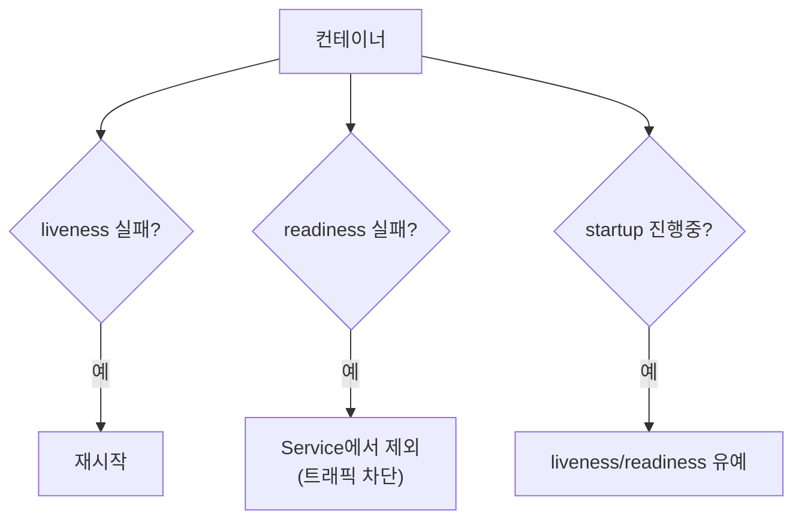
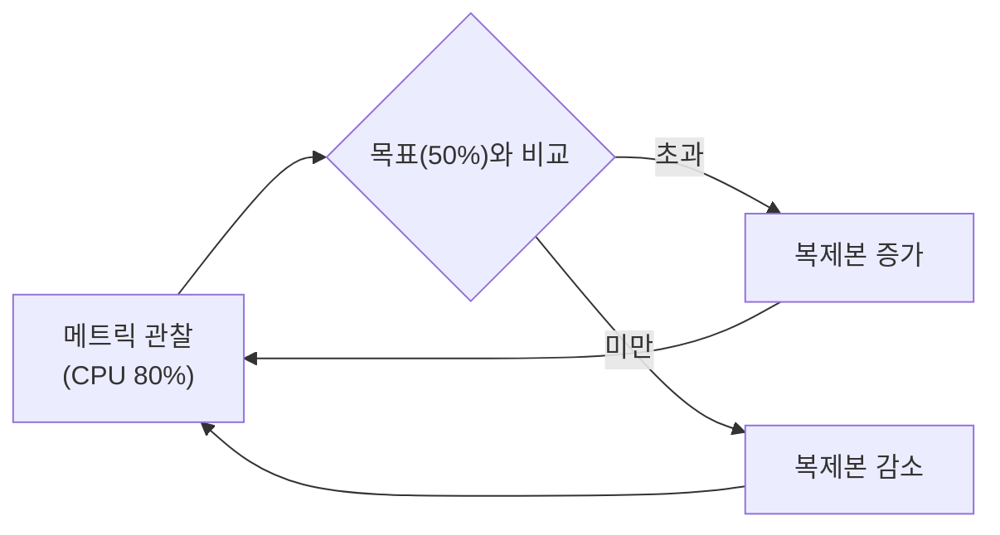

핵심 단계까지 마치면 앱을 굴릴 수 있습니다. 운영 단계의 질문은 다릅니다. **"어떻게 계속, 끊김 없이
살아있게 하는가?"** 트래픽은 출렁이고, 컨테이너는 죽고, 배포는 멈출 수 없습니다. 이 세 문제를
자동화로 푸는 것이 이번 챕터입니다.

> **핵심: 스케일은 부하가, 치유는 probe가, 무중단은 readiness가 만든다.**

## 왜 필요한가 (Why)

- **트래픽은 변한다**: 낮엔 붐비고 밤엔 한산하다. 고정 복제본은 낭비(과대) 아니면 장애(과소)다.
- **컨테이너는 "떠 있다"고 "건강한" 게 아니다**: 프로세스는 살아있지만 데드락에 빠져 응답을 못
  할 수 있다. 단순 재시작 정책만으론 이런 "좀비"를 못 잡는다.
- **배포 중 끊기면 안 된다**: 새 버전이 아직 준비 안 됐는데 트래픽을 받으면 사용자에게 에러가 간다.

## 핵심 개념 (What)

### 헬스체크 — 세 가지 probe

kubelet이 컨테이너의 건강을 주기적으로 점검하는 장치입니다. 셋의 **목적이 다릅니다.**

- **liveness probe(생존)**: "살아있나?" 실패하면 컨테이너를 **재시작**. 데드락·좀비 상태를 회복.
- **readiness probe(준비)**: "트래픽 받을 준비됐나?" 실패하면 **Service Endpoints에서 제외**(재시작 안 함).
  준비 안 된 Pod로 트래픽이 안 가게 막는 핵심.
- **startup probe(시작)**: "느린 초기화가 끝났나?" 시작이 오래 걸리는 앱을 위해 liveness/readiness를
  유예. 초기화 중 성급한 재시작을 방지.

### 오토스케일링 — 세 축

- **HPA(Horizontal Pod Autoscaler)**: 부하에 따라 **Pod 개수**를 늘렸다 줄임(수평 확장). 가장 흔함.
- **VPA(Vertical Pod Autoscaler)**: Pod의 **requests/limits**(크기)를 조정(수직 확장). 적정 자원 산정에 유용.
- **Cluster Autoscaler**: Pod를 둘 **노드가 부족하면 노드 자체를 늘림**(그 반대도). HPA와 짝으로 동작.

## 어떻게 동작하는가 (How)

### HPA의 제어 루프

HPA는 메트릭(기본 CPU 사용률, 또는 커스텀/외부 메트릭)을 주기적으로 관찰해 목표치와 비교하고,
복제본 수를 조정합니다. 조정 루프(Ch1)의 또 다른 사례입니다.

목표 복제본은 대략 `현재복제본 × (현재메트릭 / 목표메트릭)`으로 계산됩니다. 잦은 출렁임을 막으려
**안정화 윈도(stabilization window)** 로 축소를 천천히 합니다.

> 전제: HPA가 CPU 기준으로 동작하려면 **requests가 설정**되어 있고 **metrics-server**가 깔려 있어야
> 합니다(메트릭 공급원). 이게 없으면 HPA는 동작하지 않습니다.

### 무중단 배포 = 롤링 업데이트(Ch4) + readiness probe

Ch4의 롤링 업데이트가 "무중단"이 되는 결정적 조건이 readiness probe입니다. 신버전 Pod가
readiness를 통과하기 전에는 Service가 트래픽을 보내지 않으므로, 준비된 Pod로만 요청이 갑니다.

추가로 종료 측도 챙겨야 합니다.

- **graceful shutdown**: Pod 종료 시 `SIGTERM` → `terminationGracePeriod` 동안 정리 시간 → `SIGKILL`.
  진행 중 요청을 끝내고 빠지도록 앱이 신호를 처리해야 합니다.
- **PodDisruptionBudget(PDB)**: 자발적 중단(노드 드레인·업그레이드) 시 "동시에 최소 N개는 살아있어야
  한다"를 보장해 가용성을 지킵니다.

### 배포 전략

- **RollingUpdate**(기본): 점진 교체. 무중단·자원 효율.
- **Recreate**: 전부 내리고 새로 올림(짧은 다운타임). 두 버전 공존이 불가능한 경우.
- **Blue-Green / Canary**: 신버전을 별도로 띄워 일부/전체 트래픽을 전환(Ingress·서비스메시·Argo
  Rollouts 등으로 구현). 위험을 점진적으로 노출.

## 트레이드오프

| 선택 | 얻는 것 | 치르는 비용 |
| ---- | ------- | ----------- |
| HPA(수평) | 부하 대응·비용 최적 | 콜드스타트·메트릭 지연, 상태 앱엔 부적합 |
| VPA(수직) | 적정 자원 자동화 | 적용 시 Pod 재시작 유발, HPA와 동시 사용(CPU) 충돌 주의 |
| 공격적 liveness | 빠른 자가 치유 | 과민하면 정상 앱을 재시작해 장애 증폭(재시작 루프) |
| readiness 엄격 | 안전한 트래픽 차단 | 너무 엄격하면 가용 복제본이 줄어 처리력↓ |
| Canary/Blue-Green | 안전한 점진 배포 | 인프라·트래픽 라우팅 복잡, 비용↑ |

핵심: probe는 **민감도 튜닝**이 전부입니다. 너무 둔하면 못 잡고, 너무 예민하면 멀쩡한 걸 죽입니다.

## 사이드 이펙트와 주의점

- **liveness 오설정 = 재시작 루프**: liveness가 무거운 작업이나 외부 의존성을 검사하면, 일시적 지연에도
  계속 재시작되어 장애가 증폭됩니다. liveness는 "프로세스 자체"만 가볍게 보세요.
- **readiness ≠ liveness 혼동**: 외부 의존성(DB 등) 점검은 readiness에 두세요. liveness에 두면 의존성이
  잠깐 흔들릴 때 컨테이너가 재시작되며 상황을 악화시킵니다.
- **HPA와 매니페스트 replicas 충돌**: HPA가 관리하는 Deployment의 `replicas`를 GitOps가 계속 되돌리면
  싸웁니다(Ch4). HPA 대상은 replicas를 고정하지 마세요.
- **HPA 전제 누락**: metrics-server 미설치·requests 미설정이면 HPA가 조용히 동작하지 않습니다.
- **종료 시 503**: graceful shutdown·preStop 훅이 없으면 Pod가 빠지는 순간 진행 중 요청이 끊깁니다.
- **스케일다운 출렁임(flapping)**: 안정화 윈도가 짧으면 복제본이 들쭉날쭉해 캐시 효율·연결이 흔들립니다.
- **콜드스타트**: 스케일아웃된 새 Pod가 준비될 때까지 시간차가 있어, 급증 트래픽엔 약간 늦게 반응합니다.

## 용어 정리

| 용어 | 설명 |
| ---- | ---- |
| liveness probe | "살아있나" 점검. 실패 시 컨테이너 재시작 |
| readiness probe | "트래픽 받을 준비됐나" 점검. 실패 시 Service에서 제외 |
| startup probe | 느린 초기화 완료 점검. 그 전까지 다른 probe 유예 |
| HPA | 부하에 따라 Pod 개수를 조정(수평 확장) |
| VPA | Pod의 requests/limits를 조정(수직 확장) |
| Cluster Autoscaler | Pod 수용을 위해 노드 수 자체를 조정 |
| metrics-server | HPA에 CPU/메모리 메트릭을 공급하는 컴포넌트 |
| 안정화 윈도 | 스케일 조정의 출렁임을 줄이는 지연 구간 |
| graceful shutdown | SIGTERM 후 정리 시간을 거쳐 안전하게 종료 |
| PodDisruptionBudget(PDB) | 자발적 중단 시 유지해야 할 최소 가용 Pod 수 |
| RollingUpdate/Recreate | 점진 교체 / 전체 교체 배포 전략 |
| Canary / Blue-Green | 트래픽을 점진/전환 방식으로 신버전에 노출하는 배포 |

---

이로써 **운영(operations) 단계**가 끝납니다. 다음 챕터(Ch 10)부터는 **심화(advanced)** —
보안·패키징·GitOps·Operator·모니터링·Webhook으로 Kubernetes를 확장하고 자동화합니다.
