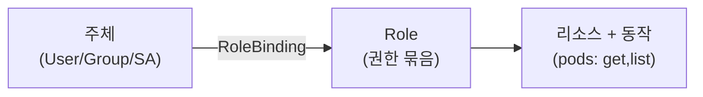
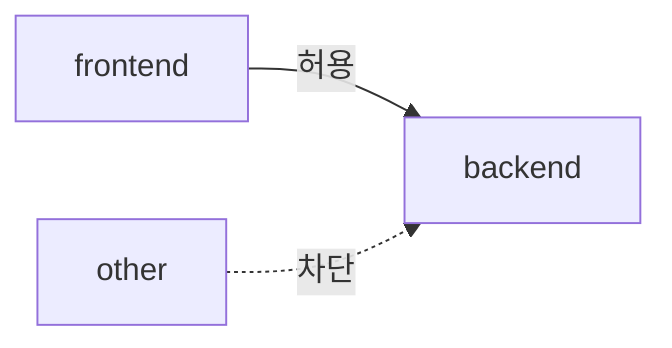

지금까지는 "어떻게 돌리나"였습니다. 심화의 첫 질문은 "어떻게 **안전하게** 나눠 쓰나"입니다.
한 클러스터를 여러 팀·여러 서비스가 공유할 때, 서로의 자원을 침범하거나 권한을 넘어서는 일을
막아야 합니다. Kubernetes의 보안 경계 도구들을 다룹니다.

> **핵심: 누가(인증) 무엇을(인가) 할 수 있고, 무엇이 무엇과(네트워크) 통신할 수 있는가를 좁힌다.**

## 왜 필요한가 (Why)

- **기본은 너무 열려 있다**: 별다른 설정이 없으면 모든 Pod가 서로 네트워크로 통신할 수 있고,
  과한 권한을 가진 토큰이 컨테이너 안에 노출됩니다. 침해 시 피해가 클러스터 전체로 번집니다.
- **여러 테넌트의 격리**: 팀 A의 실수가 팀 B를 망가뜨리면 안 됩니다. 자원·권한·네트워크를 나눠야
  합니다.
- **최소 권한 원칙(PoLP)**: 사람이든 워크로드든 "딱 필요한 만큼만" 권한을 가져야 침해 반경이 작습니다.

## 핵심 개념 (What)

### Namespace — 논리적 분할의 기본 단위

클러스터를 논리적으로 나누는 칸막이입니다. 이름 충돌 방지, 자원 쿼터(ResourceQuota), 권한·정책의
적용 범위가 됩니다. 멀티테넌시의 출발점입니다(단, **완전한 보안 격리는 아님** — 주의점 참고).

### 인증 vs 인가 — 두 단계

- **인증(Authentication)**: "당신이 누구인가." 인증서·토큰·OIDC 등으로 신원을 확인.
- **인가(Authorization)**: "그 행동이 허용되는가." Kubernetes의 표준은 **RBAC**.

### RBAC — 역할 기반 접근 제어

"누가 + 무엇을 + 어디서" 할 수 있는지를 역할로 묶어 부여합니다.

- **Role / ClusterRole**: 권한의 묶음(어떤 리소스에 어떤 동작: get/list/create/delete…).
  Role은 한 네임스페이스, ClusterRole은 클러스터 전체.
- **RoleBinding / ClusterRoleBinding**: 그 역할을 **주체(subject)** — 사용자·그룹·ServiceAccount — 에 연결.

### ServiceAccount — 워크로드의 신원

사람이 아니라 **Pod(워크로드) 자신**이 API Server에 말할 때 쓰는 신원입니다. Pod에는 기본
ServiceAccount 토큰이 주입되며, 이 SA에 RBAC로 권한을 줍니다. (사람은 User, 워크로드는 SA.)

### NetworkPolicy — Pod 간 통신 방화벽

기본적으로 모든 Pod는 서로 통신 가능합니다. **NetworkPolicy**는 라벨 셀렉터 기반으로 "누가 누구에게
인바운드/아웃바운드 통신할 수 있는지"를 제한합니다.

> 주의: NetworkPolicy는 **CNI 플러그인이 지원해야** 동작합니다(Calico, Cilium 등). 지원 안 하는
> 네트워크에선 정책을 만들어도 무시됩니다(흔한 함정).

## 어떻게 동작하는가 (How)

### 추가 보안 레이어들

- **Pod Security Admission(PSA)**: 네임스페이스 단위로 Pod의 보안 기준(privileged/baseline/restricted)을
  강제. 과거 PodSecurityPolicy(PSP)는 제거됨.
- **SecurityContext**: 컨테이너를 non-root로 실행, 권한 상승 금지, 읽기전용 루트 FS 등 컨테이너
  수준 강화.
- **ResourceQuota / LimitRange**: 네임스페이스별 총 자원 한도와 기본값을 강제(한 팀의 자원 독식 방지).
- **외부 정책 엔진**: OPA Gatekeeper, Kyverno로 조직 정책을 코드로 강제(Admission Webhook, Ch15와 연결).

## 트레이드오프

| 선택 | 얻는 것 | 치르는 비용 |
| ---- | ------- | ----------- |
| Namespace 멀티테넌시 | 단순·저비용 격리 | 커널·네트워크는 공유 → 강한 격리 아님 |
| RBAC 최소 권한 | 침해 반경 축소 | 역할 설계·유지보수 부담, 과도하면 운영 마찰 |
| NetworkPolicy 기본 차단 | 측면 이동(lateral movement) 방지 | 통신 맵을 다 정의해야 함, 디버깅 난이도↑ |
| 강한 격리(노드 분리/별도 클러스터) | 진짜 격리·규제 대응 | 비용·운영 복잡도 큼 |
| 정책 엔진(OPA/Kyverno) | 조직 표준 자동 강제 | 도입·러닝커브, 잘못된 정책이 배포를 막음 |

핵심 판단: **신뢰 경계의 강도**입니다. 같은 조직 내 팀 분리는 Namespace+RBAC+NetworkPolicy로
충분할 수 있지만, 서로 신뢰 못 하는 테넌트(예: 외부 고객)는 **별도 노드풀이나 별도 클러스터**가
정답일 때가 많습니다.

## 사이드 이펙트와 주의점

- **Namespace는 보안 경계가 아니다(완전히는)**: 노드 커널을 공유하므로, 컨테이너 탈출·커널 취약점엔
  Namespace가 방어가 안 됩니다. 강한 격리엔 노드 분리/가상화(예: gVisor, Kata)나 클러스터 분리.
- **과도한 권한 = 침해 증폭**: `cluster-admin`을 남발하거나 와일드카드 권한을 주면 토큰 하나 유출로
  클러스터가 통째로 털립니다. 최소 권한을 지키세요.
- **NetworkPolicy 미적용 함정**: 정책을 안 만들면 전면 허용이 기본입니다. 또 CNI가 미지원이면 정책이
  무시됩니다 — "정책을 만들었으니 안전"은 착각.
- **기본 ServiceAccount 토큰 노출**: 권한이 큰 SA 토큰이 Pod에 자동 주입되면 위험. 필요 없으면
  `automountServiceAccountToken: false`로 끄세요.
- **Secret 접근과의 연결**: RBAC로 Secret(Ch6) 읽기 권한을 좁히지 않으면 비밀 분리가 무의미합니다.
- **정책 엔진의 양날**: 잘못 짠 강제 정책이 정상 배포까지 거부해 장애를 만들 수 있습니다(점진 적용·
  audit 모드부터).

## 용어 정리

| 용어 | 설명 |
| ---- | ---- |
| Namespace | 클러스터를 논리적으로 나누는 칸막이(이름·쿼터·정책 범위) |
| 인증(AuthN) | 요청자가 누구인지 확인 |
| 인가(AuthZ) | 그 행동이 허용되는지 결정(표준: RBAC) |
| RBAC | 역할 기반 접근 제어 |
| Role / ClusterRole | 권한 묶음(네임스페이스 / 클러스터 범위) |
| RoleBinding / ClusterRoleBinding | 역할을 주체에 연결 |
| ServiceAccount(SA) | 워크로드(Pod)의 신원 |
| NetworkPolicy | 라벨 기반 Pod 간 통신 허용/차단 규칙 |
| CNI | Pod 네트워킹 구현 플러그인(NetworkPolicy 지원 여부 결정) |
| Pod Security Admission | 네임스페이스별 Pod 보안 기준 강제 |
| SecurityContext | non-root·권한 제한 등 컨테이너 보안 설정 |
| ResourceQuota / LimitRange | 네임스페이스 자원 총량 한도 / 기본·범위 |
| 최소 권한 원칙(PoLP) | 필요한 만큼만 권한을 부여하는 원칙 |

---

다음 챕터(Ch 11)에서는 이렇게 늘어난 매니페스트를 **재사용 가능하게 패키징**하는 Helm과
Kustomize로 들어갑니다.
