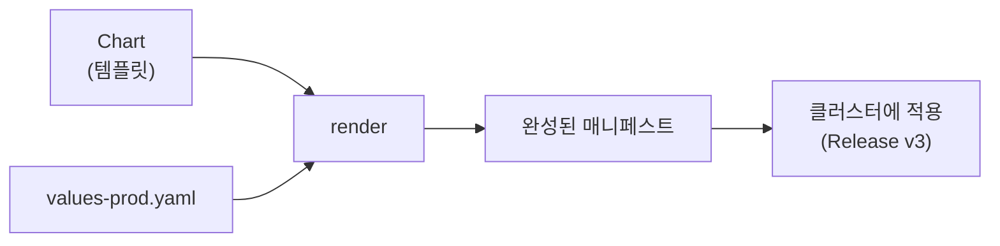
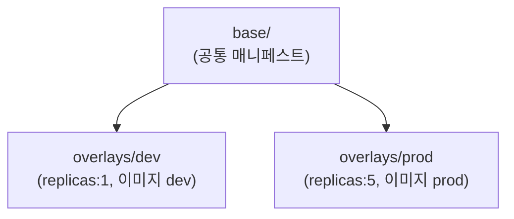

여기까지 오면 매니페스트가 폭증합니다. 같은 앱을 dev·staging·prod에 올리는데 차이는 이미지 태그와
복제본 수뿐인데도, YAML을 통째로 복붙해 세 벌 관리하게 됩니다. 복붙은 곧 불일치와 사고입니다.
이 챕터는 "한 번 정의하고 환경별로 변형"하는 두 가지 방식을 다룹니다.

> **핵심: 같은 것은 한 곳에, 다른 것만 환경별로. Helm은 "템플릿+값", Kustomize는 "베이스+패치".**

## 왜 필요한가 (Why)

- **DRY 위반**: 환경마다 YAML을 복제하면 변경 시 모든 사본을 고쳐야 하고, 빠뜨리면 환경 간 불일치(드리프트)가 생깁니다.
- **재사용·배포**: 잘 만든 앱 구성을 남에게 "설치 가능한 패키지"로 주고 싶습니다(예: 오픈소스 차트).
- **버전·롤백**: 배포를 버전으로 관리하고 한 번에 되돌리고 싶습니다.

## 핵심 개념 (What)

### Helm — 패키지 매니저 (템플릿 + 값)

Kubernetes의 "패키지 매니저"입니다. apt/npm처럼 앱을 **차트(chart)** 라는 패키지로 묶어 설치·업그레이드·
롤백합니다.

- **Chart**: 템플릿화된 매니페스트 묶음 + 기본값(`values.yaml`).
- **Values**: 환경별로 주입하는 값(`-f values-prod.yaml`). 템플릿의 변수를 채웁니다.
- **Release**: 차트를 특정 값으로 클러스터에 설치한 **실행 인스턴스**. 버전이 매겨져 롤백 가능.



```yaml filename="deployment.yaml (Helm 템플릿)"
spec:
  replicas: {{ .Values.replicaCount }}
  template:
    spec:
      containers:
        - image: "{{ .Values.image.repo }}:{{ .Values.image.tag }}"
```

### Kustomize — 템플릿 없는 오버레이 (베이스 + 패치)

kubectl에 내장된 도구입니다. 템플릿 변수 대신, **평범한 YAML(base)** 을 두고 환경별 **패치(overlay)**
로 일부만 덮어씁니다. 원본은 유효한 매니페스트 그대로입니다.



```yaml filename="overlays/prod/kustomization.yaml"
resources:
  - ../../base
patches:
  - patch: |-
      - op: replace
        path: /spec/replicas
        value: 5
    target: { kind: Deployment, name: web }
```

## 어떻게 동작하는가 (How)

### 두 방식의 철학 차이

- **Helm**: "**채워 넣는** 빈칸(템플릿)". 강력한 변수·조건·반복(loop)·함수. 외부에 배포하는 패키지에 강함.
- **Kustomize**: "**덮어쓰는** 패치(오버레이)". 템플릿 문법이 없어 원본이 항상 유효한 YAML. 내부 환경
  분리에 단순·명료.

실무에선 **둘을 함께** 쓰기도 합니다(예: Helm으로 외부 차트를 가져오고 Kustomize로 조직 표준 패치).
GitOps 도구(Argo CD/Flux, Ch12)는 둘 다 네이티브로 지원합니다.

## 트레이드오프

| 측면 | Helm | Kustomize |
| ---- | ---- | --------- |
| 변형 방식 | 템플릿 변수 채우기 | 베이스에 패치 덮어쓰기 |
| 표현력 | 강함(조건·반복·함수) | 제한적(의도적으로 단순) |
| 학습 곡선 | 템플릿 문법·함수 학습 필요 | 낮음(평범한 YAML) |
| 가독성 | 렌더 전엔 결과를 알기 어려움 | 원본이 항상 유효 YAML |
| 배포·공유 | 차트 저장소로 패키지 배포에 최적 | 패키지 배포엔 약함 |
| 버전/롤백 | Release 단위 내장 | 자체 롤백 없음(Git/GitOps에 의존) |

핵심 판단: **남에게 배포할 패키지**거나 복잡한 조건 분기가 많으면 Helm, **우리 환경의 단순한 차이만**
관리하면 Kustomize가 명료합니다.

## 사이드 이펙트와 주의점

- **Helm 템플릿은 디버깅이 어렵다**: 문자열 치환이라 들여쓰기·타입 오류가 잦습니다. `helm template`/
  `--dry-run`으로 렌더 결과를 항상 먼저 확인하세요.
- **values 폭증**: 모든 걸 값으로 빼면 `values.yaml`이 또 다른 복잡도가 됩니다. 과한 매개변수화 경계.
- **차트 신뢰성**: 외부 차트는 그 안에서 무엇을 배포하는지 모를 수 있습니다(권한·이미지 출처 검증 필요).
- **Helm 릴리스 상태 꼬임**: 실패한 업그레이드가 `pending` 상태로 남아 다음 배포를 막을 수 있습니다.
- **Kustomize는 변수가 없다**: 동적 생성이 필요한 경우 한계가 있어 무리하게 패치를 늘리면 오히려 복잡.
- **드리프트**: 누군가 클러스터를 직접 `kubectl edit`하면 패키지 정의와 실제가 어긋납니다 →
  GitOps(Ch12)가 이 문제를 정면으로 해결합니다.

## 용어 정리

| 용어 | 설명 |
| ---- | ---- |
| Helm | Kubernetes 패키지 매니저(템플릿+값 모델) |
| Chart | 템플릿화된 매니페스트 + 기본값으로 묶인 패키지 |
| values.yaml | 차트 템플릿에 주입하는 환경별 값 |
| Release | 차트를 특정 값으로 설치한 버전 관리되는 인스턴스 |
| Kustomize | 템플릿 없는 오버레이(베이스+패치) 도구. kubectl 내장 |
| base / overlay | 공통 매니페스트 / 환경별로 덮어쓰는 패치 |
| 드리프트(Drift) | 정의(Git)와 실제 클러스터 상태가 어긋난 상태 |
| DRY | 같은 것을 반복하지 말라는 원칙 |

---

다음 챕터(Ch 12)에서는 이 패키지들을 **Git을 단일 소스로 삼아 자동 배포**하는 GitOps로 들어갑니다.

## 공식 문서 참고

- [Kustomize로 Kubernetes 오브젝트 관리하기](https://kubernetes.io/docs/tasks/manage-kubernetes-objects/kustomization/)
- [Helm 공식 문서](https://helm.sh/docs/)
- [Helm 차트 가이드](https://helm.sh/docs/topics/charts/)
