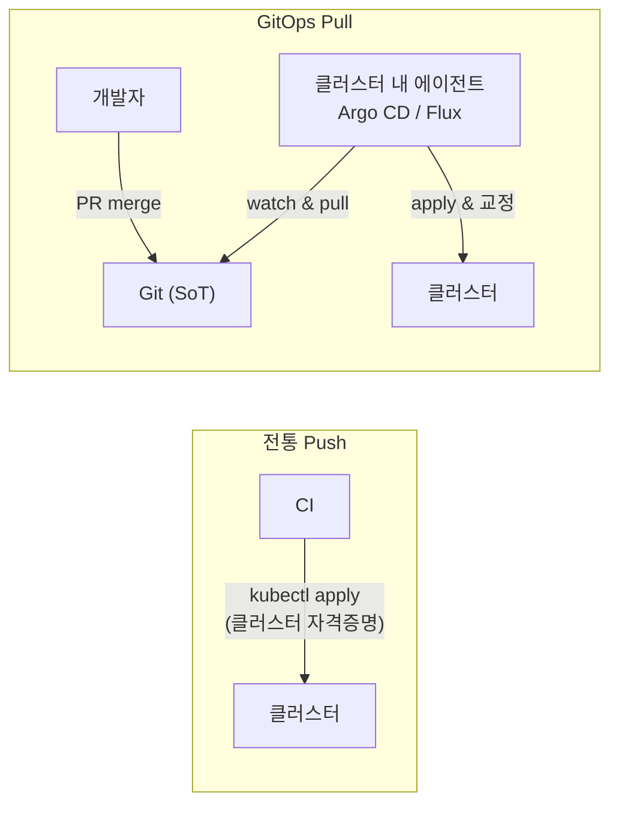
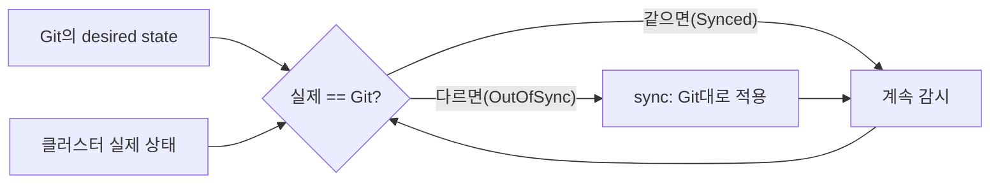

Ch11 끝에서 "드리프트" 문제를 봤습니다. 누군가 클러스터를 손으로 고치면 정의와 실제가 어긋납니다.
또 CI에서 `kubectl apply`로 배포를 밀어 넣는(push) 방식은, 클러스터 자격증명을 CI에 쥐여주고
"누가 무엇을 배포했는지" 추적이 흐려집니다. GitOps는 이 구조를 통째로 뒤집습니다.

> **핵심: 사람이 클러스터에 배포하는 게 아니라, 클러스터가 Git에 적힌 desired state로 스스로 수렴한다.**

## 왜 필요한가 (Why)

전통적 push 배포의 문제:

- **드리프트**: 수동 변경이 누적돼 실제 상태가 정의에서 벗어나도 아무도 모릅니다.
- **추적성 부족**: "지금 prod에 뭐가 떠 있나?", "이 변경 누가 했나?"의 답이 불명확합니다.
- **자격증명 노출**: CI 파이프라인이 클러스터 쓰기 권한을 들고 있어 공격면이 큽니다.
- **롤백 어려움**: "어제 상태"를 재현하기가 까다롭습니다.

GitOps의 통찰: **Git은 이미 우리가 원하는 모든 걸 갖고 있다** — 버전 이력, 리뷰(PR), 권한, 감사 로그,
롤백(revert). 그러니 "원하는 상태"를 Git에 두고, 클러스터를 거기에 맞추자.

## 핵심 개념 (What)

### GitOps의 4원칙

1. **선언적**: 시스템 전체를 선언적으로 기술(Kubernetes 매니페스트가 이미 그러함, Ch1·4).
2. **버전 관리·불변**: 그 선언을 Git에 저장 — 단일 소스 오브 트루스(SoT).
3. **자동 당겨오기(pull)**: 승인된 변경을 에이전트가 **자동으로 클러스터에 적용**.
4. **지속적 조정(reconcile)**: 에이전트가 실제 상태를 Git과 끊임없이 비교해 **드리프트를 교정**.

이건 Ch1의 조정 루프를 **"클러스터 전체"** 로 확장한 것과 같습니다.

### push vs pull

핵심 차이: pull 모델에선 **에이전트가 클러스터 안에서** Git을 당겨오므로, 외부(CI)에 클러스터
자격증명을 줄 필요가 없습니다. 사람의 인터페이스는 오직 **Git PR**입니다.

## 어떻게 동작하는가 (How)

### 조정 루프 — Git 기준

- 누군가 클러스터를 손으로 바꿔도(드리프트), 에이전트가 감지해 **Git 상태로 되돌립니다**(self-heal).
- 새 버전 배포 = **Git에 커밋/PR 머지**. 에이전트가 자동으로 당겨와 적용.
- 롤백 = Git **revert**. 에이전트가 이전 상태로 수렴.

### 대표 도구

- **Argo CD**: 애플리케이션 중심·강력한 UI. Sync 상태(Synced/OutOfSync), diff 시각화, 동기화 정책
  (auto-sync, self-heal, prune)을 제공.
- **Flux**: 쿠버네티스 네이티브·컨트롤러 조합형. GitOps Toolkit으로 모듈화. Helm·Kustomize 연동.

둘 다 Helm/Kustomize(Ch11)를 입력으로 받아 렌더 후 적용합니다.

## 트레이드오프

| 선택 | 얻는 것 | 치르는 비용 |
| ---- | ------- | ----------- |
| Git을 SoT로 | 완전한 이력·감사·리뷰·롤백 | 모든 변경이 Git을 거쳐 약간 느려짐(긴급 상황 마찰) |
| pull(에이전트) | CI에 클러스터 자격증명 불필요·보안↑ | 클러스터 내 에이전트 운영 부담 |
| 지속적 reconcile | 드리프트 자동 교정·일관성 | 수동 핫픽스가 자동으로 되돌려짐(우회 절차 필요) |
| 선언형 전면화 | 재현성·일관성 | 명령형 작업(일회성 디버깅)과의 마찰 |

핵심: GitOps는 **"긴급 수동 변경"과 상극**입니다. 급해서 클러스터를 직접 고치면 에이전트가 되돌려
버립니다. 그래서 "긴급 변경도 Git을 통해" 또는 "일시적 sync 중지" 절차를 미리 마련해야 합니다.

## 사이드 이펙트와 주의점

- **자동 self-heal의 역습**: auto-sync+self-heal이 켜진 상태에서 수동 변경은 즉시 롤백됩니다. 디버깅
  중이라면 해당 앱의 sync를 잠시 꺼야 합니다.
- **비밀 관리**: 평문 Secret을 Git에 올리면 영구 유출(Ch6). SOPS/Sealed Secrets/External Secrets로
  암호화하거나 참조만 두세요.
- **prune의 위험**: "Git에 없으면 삭제"(prune)를 켜면, 매니페스트 누락이 곧 리소스 삭제가 됩니다.
  범위와 안전장치를 신중히.
- **부트스트랩 문제**: GitOps 에이전트 자신은 누가 배포하나? 초기 설치(bootstrap)와 에이전트 업그레이드
  절차를 설계해야 합니다.
- **단일 SoT의 무결성**: Git 권한·브랜치 보호·서명이 곧 배포 보안입니다. Git이 뚫리면 클러스터가
  뚫립니다.
- **대규모 동기화 부하**: 많은 앱/리포를 감시하면 에이전트와 API Server에 부하가 갑니다(폴링 주기·
  샤딩 고려).

## 용어 정리

| 용어 | 설명 |
| ---- | ---- |
| GitOps | Git을 단일 소스로 삼아 클러스터를 선언적으로 운영하는 방식 |
| 단일 소스 오브 트루스(SoT) | 시스템 상태의 권위 있는 단 하나의 출처(여기선 Git) |
| push 배포 | 외부(CI)가 클러스터에 직접 적용하는 전통 방식 |
| pull 배포 | 클러스터 내 에이전트가 Git을 당겨와 적용하는 방식 |
| reconcile(조정) | 실제 상태를 Git과 비교해 맞추는 지속 과정 |
| drift(드리프트) | 정의(Git)와 실제 상태가 어긋난 상태 |
| Synced / OutOfSync | 실제가 Git과 일치 / 불일치한 상태 |
| self-heal | 드리프트를 Git 상태로 자동 되돌리는 기능 |
| prune | Git에서 사라진 리소스를 클러스터에서 삭제 |
| Argo CD / Flux | 대표적인 GitOps 에이전트(도구) |

---

다음 챕터(Ch 13)에서는 Kubernetes의 API 자체를 **우리 도메인 개념으로 확장**하는 CRD와 Operator
패턴으로 들어갑니다.
