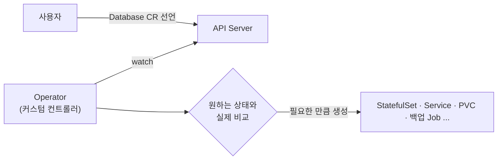

지금까지 다룬 Pod·Deployment·Service는 모두 Kubernetes가 **기본 제공**하는 리소스입니다. 그런데
"우리 회사의 `Database`", "우리만의 `Backup`" 같은 개념을 마치 Kubernetes 기본 객체처럼 다루고 싶다면?
이 챕터는 Kubernetes의 API를 **직접 확장**하고, 운영 지식을 **자동화**하는 방법을 다룹니다.

> **핵심: CRD로 "새로운 명사"를 만들고, Operator(커스텀 컨트롤러)로 그 명사를 돌보는 "조정 루프"를 더한다.**

## 왜 필요한가 (Why)

### 운영 지식은 사람 머릿속에 갇혀 있다

DB 같은 복잡한 시스템을 Kubernetes에서 운영하려면 단순히 Pod를 띄우는 걸 넘어서, 백업, 장애 조치
(failover), 버전 업그레이드, 스케일 같은 **도메인 특화 운영 절차**가 필요합니다. 이 절차는 보통
숙련된 운영자의 머릿속(runbook)에 있습니다.

문제는 이게 **수동이고 속인화(屬人化)** 된다는 점입니다. 사람이 자고 있으면 장애 조치가 안 됩니다.

### Kubernetes의 방식: 운영 지식을 컨트롤러로 코드화

Kubernetes의 핵심은 "선언 + 조정 루프"입니다(Ch1·4). 그렇다면 운영 지식도 **컨트롤러의 조정 루프로
표현**하면, "원하는 상태(예: PostgreSQL 3노드 클러스터, 매일 백업)"만 선언하고 나머지는 자동화할 수
있습니다. 이게 **Operator 패턴**입니다.

## 핵심 개념 (What)

### CRD — Custom Resource Definition

Kubernetes API에 **새로운 리소스 타입**을 추가하는 선언입니다. CRD를 등록하면, 그때부터 `kubectl get
databases` 같은 명령이 동작하고, 기본 리소스와 똑같이 etcd에 저장·RBAC 적용·watch가 됩니다.

- **CRD**: 새 타입의 "스키마 정의"(예: `Database`라는 종류가 존재한다, 필드는 이렇다).
- **CR(Custom Resource)**: 그 타입의 실제 인스턴스(예: `my-postgres`라는 Database 객체).

```yaml filename="database-cr.yaml"
apiVersion: example.com/v1
kind: Database          # CRD로 정의한 새 타입
metadata:
  name: my-postgres
spec:
  engine: postgres
  version: "16"
  replicas: 3
  backupSchedule: "0 2 * * *"
```

### Operator — CRD + 커스텀 컨트롤러

CRD만으로는 "데이터를 저장하는 새 객체"일 뿐, 아무 일도 일어나지 않습니다. **여기에 그 CR을
지켜보며 조정하는 커스텀 컨트롤러를 붙인 것**이 Operator입니다.



Operator는 "Database 3노드 + 매일 백업"이라는 선언을 받아, 그 아래 **실제 기본 리소스들**(StatefulSet,
Service, PVC, CronJob 등)을 만들고 유지하며, 장애 시 복구·백업·업그레이드까지 수행합니다.
즉 **숙련 운영자를 소프트웨어로 구현**한 것입니다.

## 어떻게 동작하는가 (How)

### 조정 루프의 재등장

Operator의 심장도 Ch1의 조정 루프입니다. CR(원하는 상태)을 watch → 실제 상태와 비교 → 차이를 메움.
이 패턴이 일관되기 때문에, 한 번 이해하면 모든 컨트롤러(기본/커스텀)가 같은 멘탈 모델로 읽힙니다.

### 만드는 법(개념 수준)

- **Kubebuilder / Operator SDK**: Go 기반으로 CRD와 컨트롤러 뼈대를 생성하는 표준 프레임워크.
- **Reconcile 함수**: "이 CR을 보고 실제를 원하는 상태로 맞춰라"는 핵심 로직을 구현.
- **성숙도 모델(Capability Levels)**: 기본 설치 → 업그레이드 → 전체 수명주기 → 통찰(메트릭) →
  자동 파일럿(오토스케일·자동 튜닝) 순으로 운영 자동화 수준이 올라감.

### Operator vs Helm 한 줄 비교

- **Helm(Ch11)**: 설치 시점에 한 번 렌더해 적용(주로 "day 1" 설치).
- **Operator**: 설치 후에도 **계속 돌면서** 장애 조치·백업·업그레이드를 수행("day 2" 운영).

## 트레이드오프

| 선택 | 얻는 것 | 치르는 비용 |
| ---- | ------- | ----------- |
| CRD로 API 확장 | 도메인 개념을 1급 객체로, RBAC·watch 그대로 활용 | API 표면 증가, 버전·스키마 관리 부담 |
| Operator 자동화 | day-2 운영 자동화·속인화 제거 | 개발·테스트·유지보수 비용 큼(사실상 컨트롤러 SW 운영) |
| 기성 Operator 사용 | 검증된 운영 지식 즉시 활용 | 블랙박스 동작·권한 범위·품질 편차 |
| 직접 Operator 개발 | 우리 도메인에 정밀 대응 | 엣지케이스·동시성·멱등성 등 분산 시스템 난제 직면 |

핵심 판단: **모든 걸 Operator로 만들지 말 것.** 단순 설치는 Helm/Kustomize로 충분합니다. Operator는
"지속적인 day-2 운영 자동화가 가치 있는 복잡한 상태 시스템"(DB, 메시지 큐, 인증서 등)에 적합합니다.

## 사이드 이펙트와 주의점

- **Reconcile은 멱등(idempotent)이어야 한다**: 같은 입력에 몇 번 돌아도 결과가 같아야 합니다. 그렇지
  않으면 루프가 자원을 중복 생성하거나 진동합니다.
- **무한 루프/진동**: Operator가 만든 리소스의 변경이 다시 reconcile을 트리거해 끝없이 도는 사고가
  흔합니다. 소유(ownerReference)·관찰 범위를 정확히.
- **과도한 watch = API Server 부하**: 잘못 짠 컨트롤러가 폭주 폴링으로 Control Plane을 압박할 수
  있습니다(Ch2의 주의점과 직결).
- **CRD 버전 관리**: 스키마가 바뀌면 기존 CR과의 호환(conversion webhook)을 챙겨야 합니다.
- **권한 과다**: Operator는 보통 강한 권한을 갖습니다. 침해 시 피해가 크므로 RBAC(Ch10)를 최소화.
- **기성 Operator 신뢰성**: 외부 Operator는 그 품질·권한·업데이트 정책을 검증해야 합니다(공급망 보안).
- **삭제 순서(finalizer)**: 외부 리소스(클라우드 디스크 등)를 정리하려면 finalizer가 필요하고, 잘못
  설정하면 객체가 영원히 삭제되지 않습니다.

## 용어 정리

| 용어 | 설명 |
| ---- | ---- |
| CRD(Custom Resource Definition) | Kubernetes API에 새 리소스 타입을 추가하는 정의 |
| CR(Custom Resource) | CRD로 정의한 타입의 실제 인스턴스 |
| Operator | CRD + 커스텀 컨트롤러. 운영 지식을 코드화한 자동화 |
| 커스텀 컨트롤러 | CR을 watch하며 조정 루프를 도는 프로그램 |
| Reconcile | 원하는 상태와 실제를 맞추는 핵심 로직 |
| 멱등성(Idempotent) | 여러 번 실행해도 결과가 같은 성질 |
| ownerReference | 리소스 간 소유 관계. 가비지 컬렉션·관찰 범위 결정 |
| finalizer | 삭제 전에 정리 작업을 보장하는 훅 |
| Kubebuilder / Operator SDK | Operator 개발 표준 프레임워크 |
| day-1 / day-2 | 설치 시점 / 설치 이후 지속 운영 |

---

다음 챕터(Ch 14)에서는 이 모든 자동화가 잘 돌고 있는지 **관측**하는 모니터링과 옵저버빌리티로
들어갑니다.
