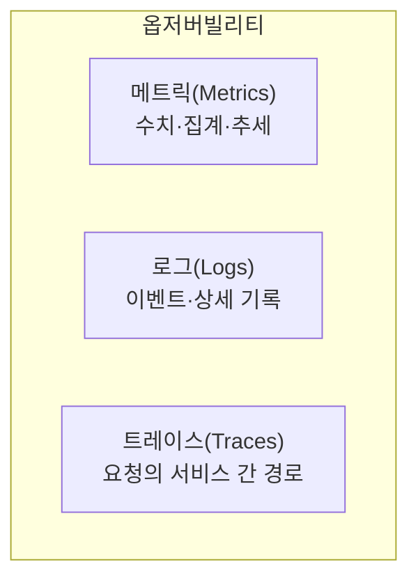
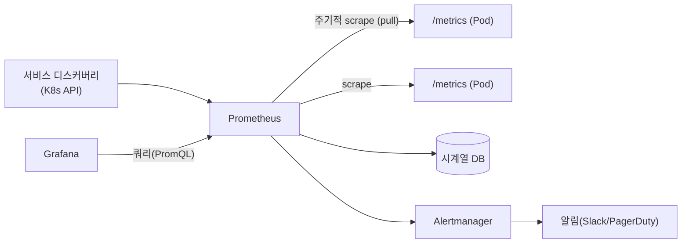

Ch1에서 "추상화의 그늘" — 층이 많아 문제 추적이 어렵다 — 을 사이드 이펙트로 꼽았습니다. 동적으로
뜨고 지는 수백 개의 Pod 속에서 "왜 느린지, 왜 죽는지"를 알아내려면 시스템이 **스스로를 관측 가능하게**
만들어야 합니다. 이 챕터는 그 관측의 원리를 다룹니다.

> **핵심: 모니터링은 "아는 문제를 본다", 옵저버빌리티는 "모르던 문제를 캐물을 수 있다".**

## 왜 필요한가 (Why)

- **동적·일시성**: Pod는 수시로 생성·소멸하고 노드를 옮깁니다. 고정 IP에 핑 날리는 전통 모니터링이
  안 통합니다.
- **분산**: 하나의 요청이 여러 서비스를 거칩니다. 한 곳의 로그만 봐선 전체 그림을 못 봅니다.
- **자동화의 맹점**: 오토스케일·자가 치유·Operator가 알아서 도는 만큼, "무엇이 왜 그렇게 동작했는지"를
  사후에 설명할 수 있어야 합니다.
- **무중단 배포의 전제**: 배포가 서비스를 악화시켰는지 **지표로** 판단해야 안전한 롤백이 가능합니다.

## 핵심 개념 (What)

### 모니터링 vs 옵저버빌리티

- **모니터링(Monitoring)**: **미리 정한** 지표·임계치를 지켜보는 것. "CPU 80% 넘으면 알림." 알려진
  실패 양식에 강함.
- **옵저버빌리티(Observability)**: 시스템이 내보내는 신호만으로 **예상 못 한 질문**에 답할 수 있는
  성질. "왜 특정 사용자만 느린가?"를 사후에 파고들 수 있는가.

### 관측의 3축 (three pillars)

- **메트릭**: 시계열 수치(요청수, 지연, 에러율, 자원 사용). 가볍고 집계·알림에 최적. "무엇이"를 빠르게.
- **로그**: 개별 이벤트의 상세 기록. "왜"를 파고들 때. 양이 많아 비용·검색이 과제.
- **트레이스**: 하나의 요청이 서비스 A→B→C를 거친 경로와 각 구간 시간. 분산 병목을 찾을 때 핵심.

### 골든 시그널 / RED / USE

무엇을 볼지에 대한 검증된 묶음:

- **4 Golden Signals**: 지연(latency), 트래픽(traffic), 에러(errors), 포화도(saturation).
- **RED**(서비스 관점): Rate, Errors, Duration.
- **USE**(자원 관점): Utilization, Saturation, Errors.

## 어떻게 동작하는가 (How)

### Prometheus — pull 기반 메트릭 수집

Kubernetes 생태계의 사실상 표준입니다. 동적 환경에 맞는 **pull 모델**이 핵심입니다.

- **pull**: Prometheus가 각 타깃의 `/metrics`를 **주기적으로 긁어옵니다(scrape)**. 타깃이 push하지
  않으므로, 뜨고 지는 Pod를 **서비스 디스커버리**(K8s API)로 자동 추적합니다.
- **PromQL**: 시계열을 질의·집계하는 언어. 대시보드·알림 규칙의 기반.
- **Alertmanager**: 알림의 그룹화·중복 제거·라우팅·무음(silence)을 담당.
- **Grafana**: 메트릭(및 로그·트레이스)을 시각화하는 대시보드.

로그는 보통 Loki/Elasticsearch, 트레이스는 Tempo/Jaeger로 모으며, **OpenTelemetry**가 세 신호를
표준 방식으로 수집·전송하는 공통 규격으로 자리잡고 있습니다.

## 트레이드오프

| 선택 | 얻는 것 | 치르는 비용 |
| ---- | ------- | ----------- |
| 메트릭 중심 | 가볍고 빠른 알림·추세 | 카디널리티 폭증 시 비용·성능 급증 |
| 로그 중심 | 상세한 사후 분석 | 저장·검색 비용 큼, 노이즈 |
| 트레이스 도입 | 분산 병목 가시화 | 계측(instrumentation) 비용, 샘플링 트레이드오프 |
| pull(Prometheus) | 동적 타깃 자동 추적·단순 | 단명 작업(Job)·외부 타깃엔 불리(Pushgateway 필요) |
| 보관 기간↑ | 긴 추세·사후 분석 | 저장 비용·쿼리 부하 |

핵심: **카디널리티(라벨 조합 수)** 가 비용을 좌우합니다. 사용자 ID 같은 고유값을 메트릭 라벨에 넣으면
시계열이 폭발합니다 — 그건 로그/트레이스의 몫입니다.

## 사이드 이펙트와 주의점

- **고카디널리티 = 비용 폭탄**: 메트릭 라벨에 무한히 변하는 값(요청 ID, 이메일)을 넣지 마세요.
  Prometheus 메모리·디스크가 터집니다.
- **알림 피로(alert fatigue)**: 너무 많은/시끄러운 알림은 무시로 이어져 진짜 장애를 놓치게 합니다.
  **증상(사용자 영향) 기반**으로, 실행 가능한 것만 알리세요(증상 vs 원인 알림 구분).
- **관측 시스템도 장애 난다**: 모니터링이 클러스터 안에만 있으면, 클러스터가 죽을 때 같이 죽어
  눈이 멉니다. 핵심 알림 경로는 외부에 이중화하세요.
- **로그 비용 통제**: 무분별한 디버그 로그는 저장·검색 비용을 폭증시킵니다. 레벨·샘플링·보존정책 설계.
- **트레이스 샘플링**: 전수 수집은 비싸고, 너무 낮은 샘플링은 드문 문제를 놓칩니다. 균형 필요.
- **대시보드만 많고 통찰은 없음**: 그래프 수가 아니라 "이걸로 어떤 결정을 하나"가 기준입니다.
- **SLO 없는 알림**: 목표(SLO)와 에러 버짓 없이 임계치만 잡으면 알림이 자의적이 됩니다.

## 용어 정리

| 용어 | 설명 |
| ---- | ---- |
| 모니터링 | 미리 정한 지표·임계치를 지켜보는 것 |
| 옵저버빌리티 | 신호만으로 예상 못 한 질문에 답할 수 있는 성질 |
| 메트릭 | 시계열 수치(요청수·지연·에러율·자원) |
| 로그 | 개별 이벤트의 상세 기록 |
| 트레이스 | 요청이 서비스들을 거친 경로와 구간 시간 |
| Prometheus | pull 기반 메트릭 수집·저장 시스템 |
| scrape | 타깃의 /metrics를 주기적으로 긁어오는 것 |
| 서비스 디스커버리 | 동적 타깃(Pod)을 자동으로 찾아 모니터링 대상에 등록 |
| PromQL | Prometheus 시계열 질의 언어 |
| Alertmanager | 알림 그룹화·라우팅·무음 처리 |
| Grafana | 관측 데이터 시각화 대시보드 |
| 카디널리티 | 라벨 조합으로 생기는 시계열의 수(비용 결정 요인) |
| 4 Golden Signals / RED / USE | 무엇을 관측할지에 대한 표준 묶음 |
| SLO / 에러 버짓 | 서비스 목표 수준 / 허용 가능한 실패 여유 |
| OpenTelemetry | 메트릭·로그·트레이스 수집의 공통 표준 |

---

다음 챕터(Ch 15, 마지막)에서는 API 요청을 **가로채 검증·변형**하는 마지막 확장 포인트 —
Admission Webhook으로 시리즈를 마무리합니다.

## 공식 문서 참고

- [시스템 메트릭](https://kubernetes.io/docs/concepts/cluster-administration/system-metrics/)
- [리소스 메트릭 파이프라인](https://kubernetes.io/docs/tasks/debug/debug-cluster/resource-metrics-pipeline/)
- [실행 중인 Pod 디버깅](https://kubernetes.io/docs/tasks/debug/debug-application/debug-running-pod/)
