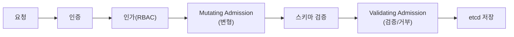
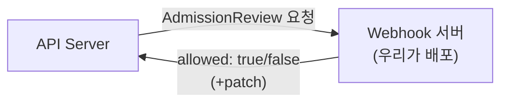

시리즈의 마지막입니다. Ch2에서 "모든 요청은 API Server를 거치고, 인증→인가→**검증(admission)** 을
지나 etcd에 저장된다"고 했습니다(Ch10에서 다시). 그 마지막 관문, **admission** 단계에 우리가
직접 끼어드는 방법이 Admission Webhook입니다. 조직의 규칙을 클러스터에 **강제로 새겨 넣는** 가장
강력한 확장 포인트입니다.

> **핵심: 객체가 저장되기 직전에 가로채 — "바꾸거나(Mutating)" / "막거나(Validating)" 한다.**

## 왜 필요한가 (Why)

RBAC(Ch10)는 "누가 무엇을 할 수 있나"는 정하지만, **"그 객체의 내용이 우리 규칙에 맞나"** 는 보지
못합니다. 예를 들어:

- "모든 Pod는 반드시 리소스 requests/limits(Ch8)를 가져야 한다."
- "`latest` 태그 이미지는 금지한다."
- "모든 워크로드에 비용 추적용 라벨을 자동으로 붙여라."
- "신뢰된 레지스트리의 이미지만 허용한다."

이런 **조직 정책**을 사람이 리뷰로만 강제하면 결국 빠져나갑니다. Admission Webhook은 이를 **API
수준에서 자동·일관되게** 강제합니다. 통과 못 하면 객체가 아예 생성되지 않습니다.

## 핵심 개념 (What)

### Admission의 두 종류

- **Mutating Admission Webhook**: 객체를 **변형**합니다(필드 주입·기본값 설정·사이드카 자동 주입 등).
  **먼저** 실행됩니다.
- **Validating Admission Webhook**: 객체를 **검증**해 허용/거부합니다. 변형은 못 하고 통과 여부만 결정.
  Mutating **이후** 실행됩니다(변형된 최종 형태를 검증해야 하므로).

순서가 중요합니다: **변형 → (스키마 검증) → 검증 → 저장.** 사이드카 자동 주입(서비스 메시)이 Mutating의
대표 사례입니다.

### 동작 방식 — webhook = 외부 HTTP 호출

API Server는 admission 단계에서 우리가 등록한 **외부 HTTPS 엔드포인트**(우리가 배포한 webhook 서버)에
객체를 담은 `AdmissionReview`를 보내고, 응답(allow/deny, 또는 변형 패치)을 받아 적용합니다.

등록은 `MutatingWebhookConfiguration` / `ValidatingWebhookConfiguration` 객체로 하며, "어떤 리소스의
어떤 동작에 대해, 어떤 엔드포인트를 부를지"를 선언합니다.

## 어떻게 동작하는가 (How)

### 정책을 코드로 — 직접 짜지 않는 길

webhook 서버를 직접 개발할 수도 있지만, 대부분은 **정책 엔진**을 씁니다(Ch10에서 언급).

- **OPA Gatekeeper**: Rego 언어로 정책 작성. ValidatingWebhook으로 동작.
- **Kyverno**: Kubernetes 친화적 YAML로 정책 작성(validate/mutate/generate). 러닝커브가 낮음.

이들은 내부적으로 Admission Webhook을 사용하며, "정책을 CRD(Ch13)로 선언"하게 해줍니다.

### failurePolicy — webhook이 죽으면?

webhook 서버가 응답하지 않을 때의 행동을 정합니다.

- **Fail**(기본): 응답 없으면 요청 **거부**. 안전하지만, webhook 장애가 곧 클러스터 마비가 될 수 있음.
- **Ignore**: 응답 없으면 요청 **통과**. 가용성은 지키지만 정책이 우회됨.

## 트레이드오프

| 선택 | 얻는 것 | 치르는 비용 |
| ---- | ------- | ----------- |
| Mutating webhook | 자동 주입·기본값으로 표준화 | "보이지 않는 변형" → 디버깅 혼란, 예측 어려움 |
| Validating webhook | 강력한 정책 강제(부적합 차단) | 잘못된 정책이 정상 배포까지 막음 |
| 정책 엔진(OPA/Kyverno) | 정책을 코드/YAML로 일관 관리 | 도입·언어 학습, 정책 자체의 테스트 필요 |
| failurePolicy: Fail | 정책 우회 불가(보안↑) | webhook 장애 = 해당 API 작업 전면 중단 |
| failurePolicy: Ignore | 가용성 보호 | 장애 중 정책이 조용히 무력화 |

핵심: Admission Webhook은 **클러스터 전체 API 경로에 끼어드는** 만큼 강력하지만 위험합니다.
잘못 만들면 **클러스터를 통째로 멈출 수 있는** 유일한 확장 포인트라는 점을 늘 기억해야 합니다.

## 사이드 이펙트와 주의점

- **webhook이 클러스터를 마비시킬 수 있다**: `failurePolicy: Fail` + webhook 서버 다운 = 해당 리소스의
  모든 생성/변경이 거부됩니다. webhook 서버 자신을 HA로, 그리고 **자기 자신·핵심 네임스페이스(kube-
  system 등)는 정책 대상에서 제외**(namespaceSelector)하세요.
- **순환 의존**: webhook 서버를 띄우는 데 필요한 리소스가 그 webhook의 검증을 받아야 하면 부팅이
  막힙니다(데드락). 제외 규칙으로 끊으세요.
- **지연(latency) 추가**: 모든 대상 요청이 외부 호출을 거치므로 API 작업이 느려집니다. timeout을
  짧게, webhook 처리를 가볍게.
- **Mutating의 비가시성**: 사용자가 적용한 것과 실제 저장된 것이 달라 혼란을 줍니다. 변형 내용을
  명확히 문서화·로깅하세요.
- **TLS·인증서 관리**: webhook은 HTTPS이며 API Server가 인증서를 신뢰해야 합니다(caBundle). 인증서
  만료가 곧 장애.
- **정책 점진 적용**: 처음부터 enforce(차단)로 켜면 기존 워크로드가 줄줄이 막힙니다. **audit/warn
  모드로 먼저** 영향 범위를 파악한 뒤 enforce로 전환하세요.
- **순서 의존 버그**: Mutating 여러 개가 서로의 결과에 의존하면 순서·재실행으로 예측 불가해집니다.

## 용어 정리

| 용어 | 설명 |
| ---- | ---- |
| Admission | 인증·인가 이후, etcd 저장 직전 요청을 검사·변형하는 단계 |
| Mutating Admission Webhook | 객체를 변형(필드 주입·기본값·사이드카 주입). 먼저 실행 |
| Validating Admission Webhook | 객체를 검증해 허용/거부. Mutating 이후 실행 |
| AdmissionReview | API Server가 webhook에 보내는 요청/응답 객체 |
| MutatingWebhookConfiguration | Mutating webhook 등록 객체 |
| ValidatingWebhookConfiguration | Validating webhook 등록 객체 |
| failurePolicy | webhook 무응답 시 행동(Fail=거부 / Ignore=통과) |
| namespaceSelector | webhook 적용 대상 네임스페이스를 한정(자기 제외 등) |
| OPA Gatekeeper / Kyverno | Admission Webhook 기반 정책 엔진 |
| caBundle | API Server가 webhook의 TLS를 신뢰하기 위한 인증서 |
| audit / enforce | 위반을 기록만 / 실제로 차단하는 정책 모드 |

---

## 시리즈를 마치며

Ch1의 한 문장 — **"원하는 상태를 선언하면 실제 상태를 맞춰주는 시스템"** — 으로 시작해, 그 조정
루프가 부품(Ch2), 실행 단위(Ch3), 컨트롤러(Ch4)로 구현되는 과정을 따라왔습니다. 네트워킹·설정·
스토리지·스케줄링(Ch5~8)으로 워크로드를 굴리고, 오토스케일·무중단 배포(Ch9)로 살아있게 만들고,
보안·패키징·GitOps·Operator·모니터링·Webhook(Ch10~15)으로 확장·자동화했습니다.

관통하는 하나의 사상은 변하지 않았습니다 — **선언하고, 조정 루프가 수렴시킨다.** 새로운 Kubernetes
기능을 만나면 늘 이렇게 물어보세요. *"무엇이 desired state이고, 누가 그것을 조정하는가?"* 그 답을
찾으면, 대부분의 설계가 다시 자연스럽게 읽힐 것입니다.

## 공식 문서 참고

- [Admission Controller](https://kubernetes.io/docs/reference/access-authn-authz/admission-controllers/)
- [Dynamic Admission Control](https://kubernetes.io/docs/reference/access-authn-authz/extensible-admission-controllers/)
- [Admission Webhook 권장 사항](https://kubernetes.io/docs/concepts/cluster-administration/admission-webhooks-good-practices/)
